# Our Jodel: Conceptual Design
## Data Model

### Entity-Relationship Diagram

### Data Dictionary

#### Post

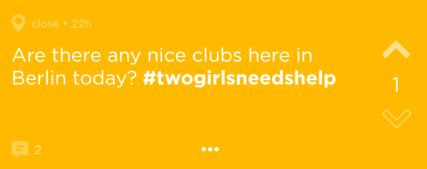

A *Post* is a message, picture or video (up to 20 seconds) that is published by a User.

A *Jodel* is a Post that starts a thread.

A *Reply* is a Post written in answer or response to a Jodel.

| Attribute   | Description                                                  |
| ----------- | ------------------------------------------------------------ |
| message     | Text can have length up to 240 characters.                   |
| imageBase64 | Image encoded base 64. Can be a very short video, up to 20 seconds. |
| user_handle | This is a number uniquely identifies the posting user in the thread, i.e. when the first replier makes another reply on the same Jodel, that reply will have the same user_handle as the first. However, the user_handle is not unique for every user in every thread, i.e. when a replier makes another reply on a different Jodel, that reply will have a different user_handle. In other words, it is possible to know which replies on a Jodel was made by the same User, but it is not possible to reconstruct a user's Jodel activities from long-time observations. The *Original Jodeler* is the User who posted the initial Jodel. His user_handle is 0, and his posts on the thread are identified by the initials OJ. |
| color       | The color has no actual meaning. The color of a Jodel is selected randomly when the user clicks the &ldquo;+&rdquo; button. The color of a Reply is always the same as the color of the parent Jodel. Posts can have seven colors:  |
| latitude    | Signed latitude of the location of posting, in degrees, with precision of 5 decimal places. |
| longitude   | Signed longitude of the location of posting, in degrees, with precision of 5 decimal places. |
| distance    | One of the following: &bull; **here**: less than 1 km; &bull; **very-close**: between 1 and 2 km; &bull; **close**: between 2 and 10 km; &bull; **far**: more than 10 km; &bullet; **hometown**: if posted using *hometown* feature. The *hometown* feature allows users to read and write posts in a place they are not currently in. However, this location must be set once by the user and then it can not be changed. Only the current location of the user can be set as his hometown.  At first, only posts posted within a 10 km radius are shown in the feed. When there are many users in the area, the users enjoy a lot of activity; less populated areas, on the contrary, can spot tumbleweed in their less engaged feeds. To mitigate this issue we introduce the *dynamic radius* feature. With the dynamic radius the radius will be increased in 10 km steps until the area has more than 150 Jodels or the radius reach 100 km.   The distance in kilometers between two points located at (&phi;0, &lambda;0) and (&phi;1, &lambda;1), where latitude &phi; and longitude &lambda; are in degrees,  can be calculated by the following approximate formula:    This approximation is very fast and produces fairly accurate result for small distances. Also in ordering locations by distance, it is much faster to order by squared distance eliminating the need for computing the square root. For instance, the distance between  Praça da Sé in São Paulo, at (-23.5503&deg;, -46.6334&deg;) and  Praça XV in Rio de Janeiro, at (-22.9028&deg;, -43.1733&deg;),  using the above formula, is 360.0 km.  Using an [accurate geodesic calculator](https://geographiclib.sourceforge.io/cgi-bin/GeodSolve?type=I&input=-23.5503+-46.6334+-22.9028+-43.1733&format=g&azi2=f&unroll=r&prec=3&radius=6378137&flattening=1%2F298.257223563&option=Submit), the distance is 361.1 km. |
| city        | Name of the city. e.g.: São Paulo                            |
| createdAt   | Date-time of the post                                        |
| childCount  | For Jodel, it is the number of replies. For replies, it is null. |
| voteCount   | number of upvotes minus number of downvotes.  When a post has voteCount of -5 it disappears. |

#### User

| Attribute      | Description                                                  |
| -------------- | ------------------------------------------------------------ |
| **cellphone**  | Cell phone number.                                           |
| activationCode | Activation code.                                             |
| latitude       | Signed latitude of user's location, in degrees, with precision of 5 decimal places. |
| longitude      | Signed longitude of the user's location, in degrees, with precision of 5 decimal places. |
| location       | Name of the user's location, normally equals to the name of the city. |
| city           | Name of the city of the the user's location, e.g.: São Paulo |
| country        | Two letter country code, e.g. BR                             |
| group          | &bull; **Aprendiz** &bull; **Funcionário** &bull; **Colegial** &bull; **Vestibulando** &bull; **Universitário** &bull; **Pós-graduando** &bullet; **Empresário / Autônomo** &bullet; **Servidor Público** &bullet; **Aposentado** |
| gender         | &bullet; **male**  &bullet; **female**  &bullet; **other** |
| birthyear      | User's birthyear with 4 digits.                              |
| karma          | User's score:   &bull; The user earns (looses) 2 karma for upvoting (downvoting) on a post  &bull; The user earns (looses) 10 karma when he receives an upvote (downvote)  &bull; The user earns 1 karma for thanking another user who replies to his post  &bull; The replier earns 5 karma for receiving thanks. |

#### Remark

| Attribute | Description                                                  |
| --------- | ------------------------------------------------------------ |
| kind      | One of the following: &bull; **upvote** &bullet; **downvote** &bullet; **subscribe**: The User will receive push notifications on any updates to the subscribed Jodels. The Jodels and Replies posted by the User are automatically subscribed; &bullet; **thank**: the OJ can thank for a reply from another user, after upvoting it; &bullet; **pin**: Allows the User to save and follow the Jodel. The User will receive push notifications on any updates to the pinned Jodels. The pinned Jodels will be visible in the &ldquo;My Pins&rdquo; section. |

#### Notification

| Attribute   | Description                                                  |
| ----------- | ------------------------------------------------------------ |
| description | Notifications are emitted in the background on events occurring on the Jodel you subscribed or pinned. This attribute describes which event occurred: &bullet; **Reply from OJ**: OJ replied on the Jodel you subscribed; &bullet; **Thanks from OJ**: Your Reply received thanks; &bullet; **Reply on Jodel**: a reply was posted on the Jodel you subscribed; &bullet; **Reply on Pin**: a reply was posted on a Jodel you pinned. |
| read        | Flag to signal that the notification has been read.          |
| time        | Date and time of the event.                                  |

#### BoostedPostBooking

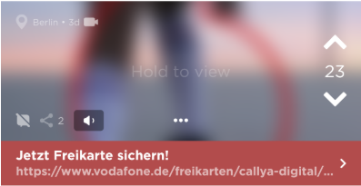

| Attribute | Description                                                  |
| --------- | ------------------------------------------------------------ |
| headline  | The headline of the url. E.g.: **Jetzt Freikarte sichern!**   In each area, there can be only one boosted post at a time.  The boosted post appears first in the User's feed. Each boosted post is a regular post, thus Users can vote or reply on it (replying can be optionally disabled by the poster). Only difference: if the User downvote it, the post will disappear for the User. |
| url       | The URL of the ad. E.g.: https://www.vodafone.de/freikarten/callya-digital |
| startTime | Date and time of the booking.                                |
| endTime   | Date and time of the removal.                                |
| latitude  | This is the signed latitude of the point of placement, in degrees, with precision of 5 decimal places. |
| longitude | This is the signed longitude of the point of the placement, in degrees, with precision of 5 decimal places. |
| radius    | Boosted post coverage radius.                                |
| canReply  | Flag to enable replies to this placement.                    |

#### Channel

| Attribute     | Description                                                  |
| ------------- | ------------------------------------------------------------ |
| **name**      | Unique identifier of channel, CamelCase style.  Users will not be able to create their own channels, but will be able to follow the ones we will create. User's feed will show the Jodels from the channels followed by him. |
| description   | Description of this channel.                                 |
| followerCount | Count of the number of users in the local area that are currently following this channel. |

## Functional Processes

### User Account Management

#### Signup

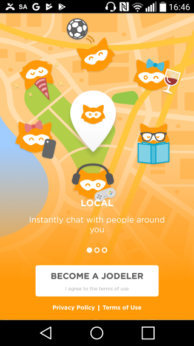

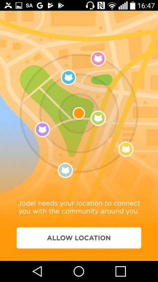

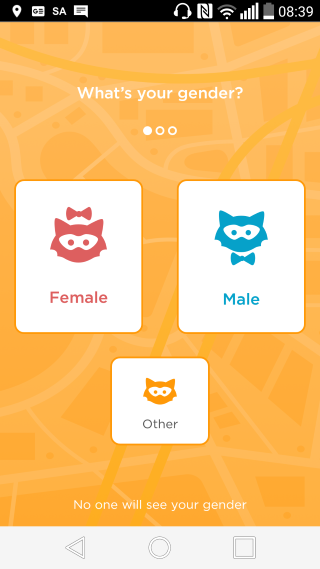

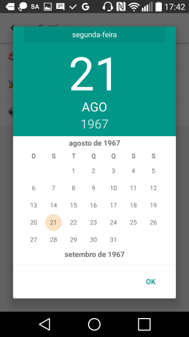

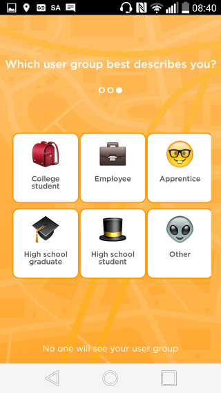

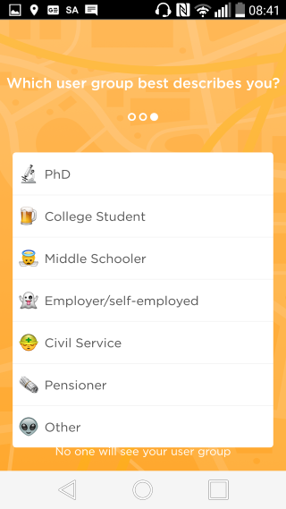

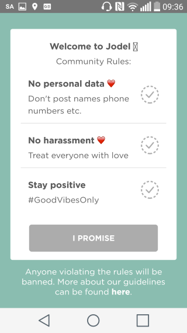

| Functional User | Sub-process Description                                      | Data Group                   | Data Mvmt Type | CFP  |
| ------------------- | ------------------------------------------------------------ | ---------------------------- | ---------------------- | ---- |
| User                | User enters his details                                      | User                         | E                      | 1    |
|                     | Server validates the entered data and checks if the User already exists | User                         | R                      | 1    |
| SMS provider    | Server sends text message with activation code,              | Activation record            | X                      | 1    |
|                     | App waits text message with activation code returns.         | Activation Record            | R                      | 1    |
|                     | App authenticates the Activation Record                      | Activation Record            | R                      | 1    |
|                     | App creates a new User                                       | User                         | W                      | 1    |
|                     | App save Activation Record in the device.                    | Activation Record            | W                      | 1    |
|                     | **Initialize App**                                           |                              |                        |      |
| User                | App displays confirmation/error message                      | Confirmation  /Error message | X                      | 1    |

**Total: 8  CFP**

#### Initialize App

| Functional  User | Sub-process Description                                      | Data Group         | Data Mvmt Type | CFP  |
| -------------------- | ------------------------------------------------------------ | ------------------ | ---------------------- | ---- |
| User                 | User starts App.                                             | Control Command    | E                      | 1    |
|                      | App retrieves the Activation Record.                         | Activation Record  | R                      | 1    |
|                      | Server authenticates the User's Activation Record and returns a JWT Access Token, valid for 24 hours. | User, Access Token | R                      | 1    |
|                      | App saves the Access Token in the device storage. The App will send the Access Token in the authentication header of the HTTP requests: &ldquo;Authentication: Bearer {token}&rdquo;. This authorizes the User for seeing posts, voting, posting etc. | Access Token       | W                      | 1    |
|                      | **Display Main Feed**                                        |                    |                        |      |
| User                 | App displays error message                                   | Error message      | X                      | 1    |

**Total: 5 CFP**

### Reading Posts

#### Display Feed

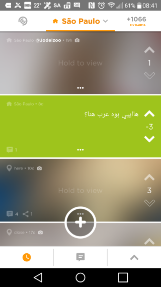

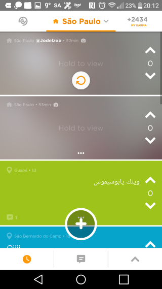

| Functional User | Sub-process Description                                      | Data Group                    | Data Mvmt Type | CFP  |
| ------------------- | ------------------------------------------------------------ | ----------------------------- | ---------------------- | ---- |
|                     | **Set Location**                                             | User Location, Dynamic Radius |                        |      |
| User                | A *Feed* consists of a set of three views listing Jodels only, the Replies does not show up : &bullet; &#x1f553; **Newest**: up to 150 Jodels in reverse chronological order;  &bullet; &#x1f4ac; **Most discussed**: up to 150 Jodels ordered by child count descending;  &bullet;  ∧ **Loudest**: up to 150 Jodels ordered by vote count descending. The User can choose which view he wants to read by clicking one of the buttons at the bottom of the screen. The Feed is refreshed if the User swipe down on the first page. | Control Command               | E                      | 1    |
| User                | App displays a scrollable list of Jodels from the chosen view. | Jodel                         | X                      | 2    |
| User                | App displays error message                                   | Error message                 | X                      | 1    |

**Total: 4 CFP**

#### Display Main Feed

| Functional User | Sub-process Description                                      | Data Group    | Data Mvmt Type | CFP  |
| ------------------- | ------------------------------------------------------------ | ------------- | ---------------------- | ---- |
|                     | App retrieves the nearest 150 Jodels in order to determine the dynamic radius. | Post          | R                      | 1    |
|                     | App retrieves Main Feed:  &bullet; **Newest**: Up to 150 Jodels within the dynamic radius, from User's channels, sorted in reverse chronological order.  &bullet; **Most Discussed**: Up to 150 Jodels within the dynamic radius, from User's channels, posted in the last 7 days, ordered by reply count descending.  &bullet; **Loudest**: Posts within the dynamic radius, from User's channels, posted in the last 7 days, ordered by vote count descending. | Jodel         | R                      | 3    |
| User                | **Display Feed**.                                            | Post          |                        |      |
| User                | App displays Error message.                                  | Error Message | X                      | 1    |

**Total: 5 CFP**

#### Display My Posts Feed

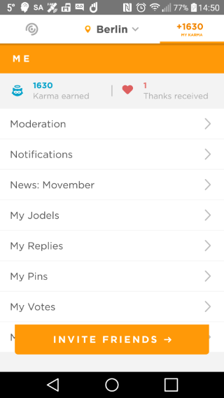

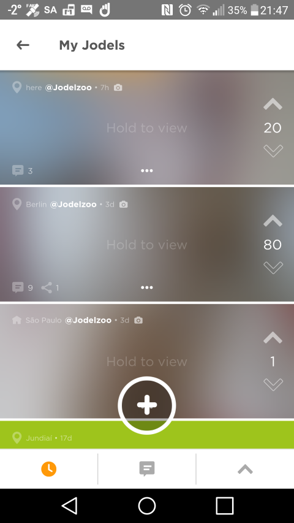

| Functional User | Sub-process Description                                      | Data Group    | Data Mvmt Type | CFP  |
| ------------------- | ------------------------------------------------------------ | ------------- | ---------------------- | ---- |
| User                | User clicks on MY KARMA button, at upper right corner of main Feed screen. The App displays ME screen. The User clicks on My Jodels button. | User          | E                      | 1    |
|                     | App retrieves My Posts Feed:  &bullet; **Newest**: Posts posted by the User, sorted in reverse chronological order.  &bullet; **Most Discussed**: Posts posted by the User, ordered by reply count descending.  &bullet; **Loudest**: Posts posted by the User, ordered by vote count descending. | Jodel         | R                      | 3    |
| User                | **Display Feed**.                                            | Jodel         |                        |      |
| User                | App displays error message                                   | Error message | X                      | 1    |

**Total 5 CFP**

#### Display My Remarks

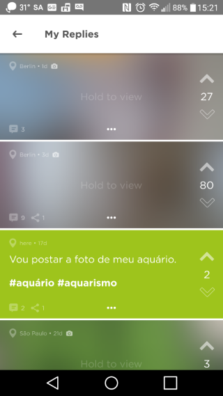

| Functional User | Sub-process Description                                      | Data Group    | Data Mvmt Type | CFP  |
| ------------------- | ------------------------------------------------------------ | ------------- | ---------------------- | ---- |
| User                | On ME screen, User clicks on My Replies, My Pins or My Votes button. | Remark Kind   | E                      | 1    |
|                     | The App retrieves posts in reverse chronological order according to the chosen remark kind:  &bullet; **reply**: posts the User replied . Note that the replies does not show up in this screen, only the Jodels that the User replied;  &bullet; **pin**: posts the User pinned;  &bullet; **vote**: posts the User upvoted. Note that, even the User upvoted a reply, only Jodels appear in this screen, | Jodel         | R                      | 1    |
| User                | Display the retrieved list.                                  | Post          | X                      | 1    |
| User                | App displays error message                                   | Error message | X                      | 1    |

**Total: 4 CFP**

#### Display Picture Feed

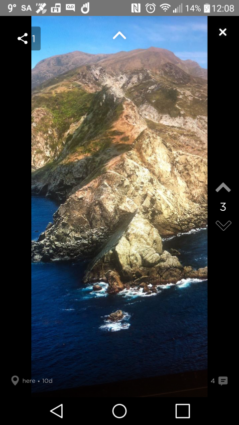

| Functional User | Sub-process Description                                      | Data Group    | Data Mvmt Type | CFP  |
| ------------------- | ------------------------------------------------------------ | ------------- | ---------------------- | ---- |
| User                | In Feed Screen, User hold button &ldquo;Hold to view&rdquo; , then Swipe up  to access Picture Feed. | Picture       | E                      | 1    |
|                     | App retrieves one picture at a time as User scrolls through the Picture Feed screen. | Picture       | R                      | 2    |
| User                | Display the current Picture with message overlaid at top left. Sponsored ads may be inserted in the Picture Feed. | Picture       | X                      | 1    |
| User                | App displays error message.                                  | Error message | X                      | 1    |

**Total: 5 CFP**

### Interacting with Single Posts

#### Create Jodel

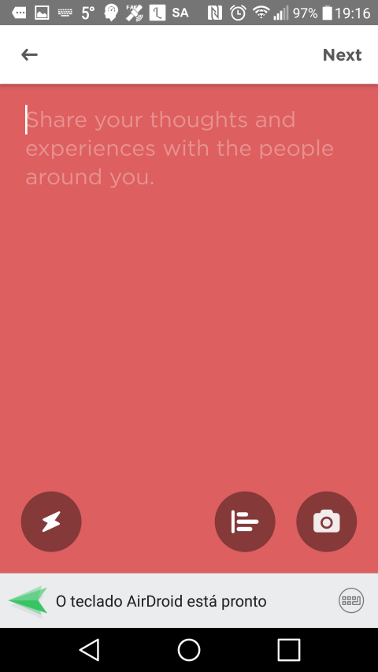

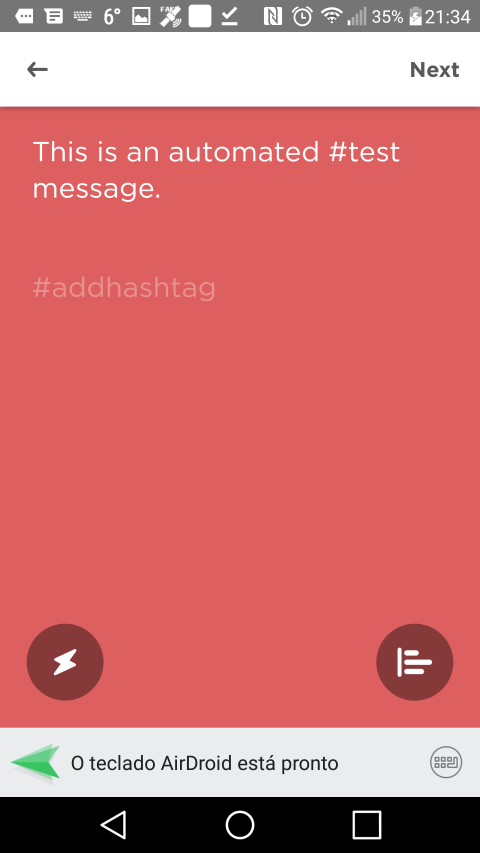

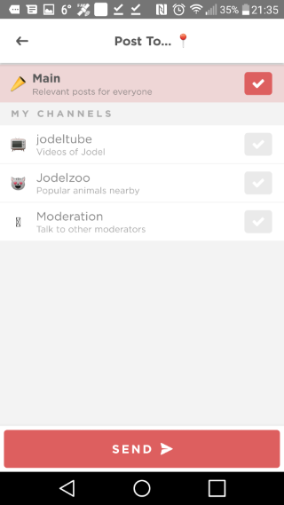

| Functional User | Sub-process Description                                      | Data Group    | Data Mvmt Type | CFP  |
| ------------------- | ------------------------------------------------------------ | ------------- | ---------------------- | ---- |
| User                | User types message and clicks &ldquo;Next&rdquo;.            | Post Message  | E                      | 1    |
|                     | App retrieves User's channels and displays &ldquo;Post To&hellip;&rdquo;  to screen. | Channel       | R                      | 1    |
| User                | User selects the Channel to post and clicks the SEND button. | Channel       | E                      | 1    |
|                     | App creates Post.                                            | Jodel         | W                      | 1    |
|                     | **Display Feed**                                             |               |                        |      |
| User                | App displays error message.                                  | Error message | X                      | 1    |

**Total: 5 CFP**

#### Create Picture Jodel

| Functional User | Sub-process Description                                      | Data Group | Data Mvmt Type | CFP  |
| ------------------- | ------------------------------------------------------------ | ---------- | ---------------------- | ---- |
| User                | On Create Post Screen, User clicks 📷 button. The User takes a picture and clicks over the taken picture to type the Post message. | Jodel      | E                      | 1    |
|                     | **Create Post**                                              |            |                        |      |

**Total: 1 CFP**

#### Display Jodel Details

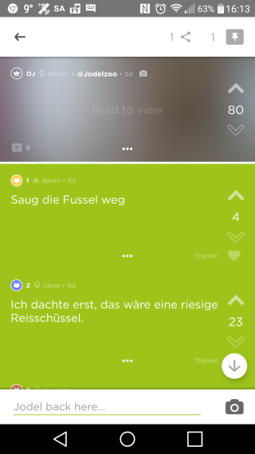

| Functional User | Sub-process Description                                      | Data Group           | Data Mvmt Type | CFP  |
| ------------------- | ------------------------------------------------------------ | -------------------- | ---------------------- | ---- |
| User                | On the Feed screen, User clicks on a Jodel.                  | Jodel                | E                      | 1    |
|                     | App retrieves the replies and the Notifications associated to the Jodel. | Reply , Notification | R                      | 2    |
|                     | App marks any existing Notification as read.                 | Notification         | W                      | 1    |
| User                | App displays the Jodel and a scrollable list of Replies. Note that each Reply on the list is labeled with the user_handle.  The Jodel Details Screen is refreshed if the User swipe down on the first page. | Reply                | X                      | 1    |
| User                | App displays error message.                                  | Error message        | X                      | 1    |

**Total:  6 CFP**

#### Send Message Reply

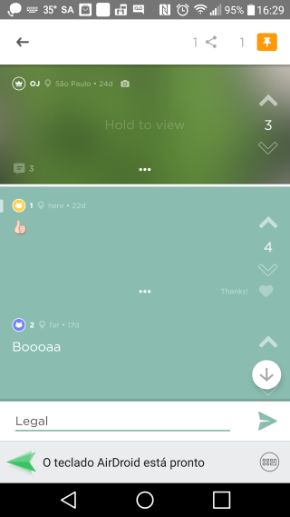

| Functional User | Sub-process Description                                      | Data Group        | Data Mvmt Type | CFP  |
| ------------------- | ------------------------------------------------------------ | ----------------- | ---------------------- | ---- |
| User                | On Jodel Details Screen, User types message and clicks Send button | Reply Message | E                      | 1    |
|                     | App creates Reply.                                           | Reply             | W                      | 1    |
|                     | App displays Jodel Details Screen with the reply added at the end. | Reply             | X                      | 1    |
| User                | App displays error message.                                  | Error message     | X                      | 1    |

**Total: 4 CFP**

#### Send Picture Reply

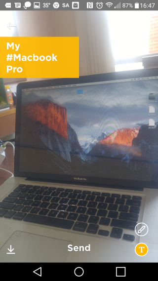

| Functional User | Sub-process Description                                      | Data Group        | Data Mvmt Type | CFP  |
| ------------------- | ------------------------------------------------------------ | ----------------- | ---------------------- | ---- |
| User                | On Jodel Details Screen, User clicks 📷 button. The User takes a picture, clicks over the taken picture and type the Post message. The User clicks Send button. | Reply Picture | E                      | 1    |
|                     | App creates Reply.                                           | Reply             | W                      | 1    |
|                     | App displays Jodel Details Screen with the reply added at the end. | Reply             | X                      | 1    |
| User                | App displays error message.                                  | Error message     | X                      | 1    |

**Total: 4 CFP**

#### Share a Jodel

| Functional User | Sub-process Description                                      | Data Group          | Data Mvmt Type | CFP  |
| ------------------- | ------------------------------------------------------------ | ------------------- | ---------------------- | ---- |
|                     | App retrieves sharing count.                                 | Jodel Sharing Count | R                      | 1    |
| User                | App displays sharing count.                                  | Jodel Sharing Count | X                      | 1    |
| User                | On Jodel Details Screen, User clicks  share button at the top right. | Jodel               | E                      | 1    |
|                     | App retrieves the share URL of the Jodel, that shows the parent Jodel and all the replies, messages and pictures. E.g.: https://shared.jodel.com/YTr85rK5l1 | URL                 | R                      | 1    |
| Sharing Service     | App sends the URL to the recipient using the Sharing Service. | URL                 | X                      | 1    |
|                     | App updates sharing count on the database.                   | Jodel               | W                      | 1    |
| User                | App updates sharing count display.                           | Jodel               | X                      | 1    |
| User                | App displays error message.                                  | Error message       | X                      | 1    |

**Total: 8 CFP**

#### Pin / Unpin a Jodel

| Functional User | Sub-process Description                                      | Data Group          | Data Mvmt Type | CFP  |
| ------------------- | ------------------------------------------------------------ | ------------------- | ---------------------- | ---- |
|                     | App retrieves pin count.                                     | Jodel Sharing Count | R                      | 1    |
| User                | App displays pin count.                                      | Jodel Sharing Count | X                      | 1    |
| User                | On Jodel Details Screen, User clicks  share button at the top right. | Jodel               | E                      | 1    |
|                     | App updates the database.                                    | Jodel, Remark       | W                      | 1    |
| User                | App updates the pin display.                                 | Jodel               | X                      | 1    |
| User                | App displays error message.                                  | Error message       | X                      | 1    |

**Total: 6 CFP**

#### Upvote / Downvote a Post

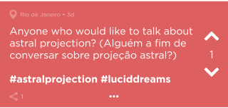

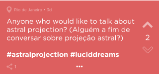

| Functional User | Sub-process Description                                      | Data Group    | Data Mvmt Type | CFP  |
| ------------------- | ------------------------------------------------------------ | ------------- | ---------------------- | ---- |
| User                | On a Post Display, the User clicks ∧ or ∨ buttons to upvote or downvote a post. If the user already voted | Post, Remark  | E                      | 1    |
|                     | App updates data base.                                       | Post, Remark  | W                      | 1    |
|                     | App updates Post Display.                                    | Post          | X                      | 1    |
| User                | App displays error message.                                  | Error message | X                      | 1    |

**Total: 4 CFP**

#### Give Thanks

| Functional User | Sub-process Description                                      | Data Group         | Data Mvmt Type | CFP  |
| ------------------- | ------------------------------------------------------------ | ------------------ | ---------------------- | ---- |
| User                | After OJ upvotes a reply, the ∧ becomes a ♡. The OJ clicks the ♡ to give thanks. | Post, Remark       | E                      | 1    |
|                     | App updates data base.                                       | Post, Remark, User | W                      | 1    |
|                     | App updates Post Display showing a dimmed ♡ at the bottom right. | Post               | X                      | 1    |
| User                | App displays error message.                                  | Error message      | X                      | 1    |

**Total: 4 CFP**

#### Enable / Disable Notifications

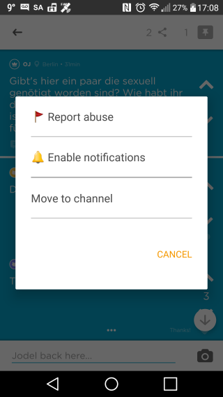

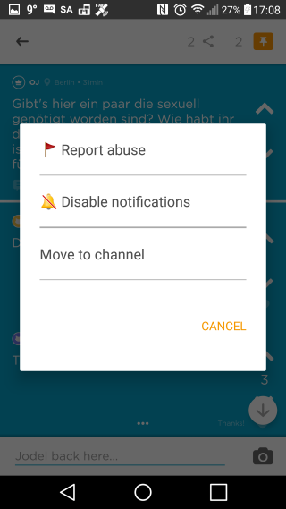

| Functional User | Sub-process Description                                      | Data Group    | Data Mvmt Type | CFP  |
| ------------------- | ------------------------------------------------------------ | ------------- | ---------------------- | ---- |
| User                | On Jodel Detail Screen, the User taps on the 3 dots (...) at the bottom of the Jodel. Then he selects &ldquo;Enable notifications&rdquo; or &ldquo;Disable notifications&rdquo;  to toggle notification status. | Post, Remark  | E                      | 1    |
|                     | App updates data base.                                       | Post, Remark  | W                      | 1    |
| User                | App displays error message.                                  | Error message | X                      | 1    |

**Total: 3 CFP**

#### Delete Post

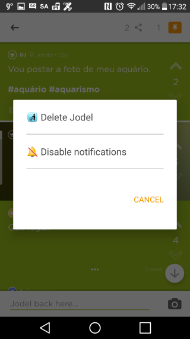

| Functional User | Sub-process Description                                      | Data Group    | Data Mvmt Type | CFP  |
| ------------------- | ------------------------------------------------------------ | ------------- | ---------------------- | ---- |
| User                | On Jodel Detail Screen, the User taps on the 3 dots (...) at the bottom of his own Jodel or Reply. Then he selects &ldquo;Delete Jodel&rdquo;. | Post, Remark  | E                      | 1    |
|                     | App updates data base. When a Reply is deleted, the notifications status of the Jodel remains unchanged. When a Jodel is deleted, all the replies and users' remarks associated are also deleted. | Post, Remark  | W                      | 1    |
| User                | When a Reply is deleted, the App continues to display the Jodel Detail Screen. When a Jodel is deleted, the App returns to Main Feed Display. | Jodel, Reply  | X                      | 1    |
| User                | App displays error message.                                  | Error message | X                      | 1    |

**Total: 4 CFP**

### Interacting with Notifications

#### Push Notifications

| Functional User  | Sub-process Description                                      | Data Group   | Data Mvmt Type | CFP  |
| -------------------- | ------------------------------------------------------------ | ------------ | ---------------------- | ---- |
| Another User         | Another User replies on a Jodel.                             | Reply        | E                      | 1    |
|                      | Server checks the Users who should receive push Notifications. | User, Remark | R                      | 1    |
|                      | Server creates and sends the Notifications.                  | Notification | W                      | 1    |
| Notification Service | App receives Notification and dispatches it to the Notification Service of the device. | Notification | X                      | 1    |
| User                 | User opens Notification.                                     | Notification | E                      | 1    |
| User                 | System opens App.                                            | Notification | X                      | 1    |
|                      | **Display Jodel Details**                                    | Jodel        |                        |      |

**Total: 6 CFP**

#### Display Notification Center

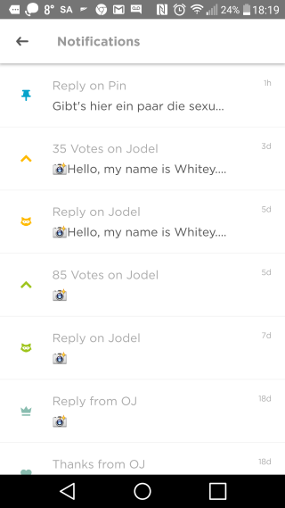

| Functional User | Sub-process Description                                      | Data Group    | Data Mvmt Type | CFP  |
| ------------------- | ------------------------------------------------------------ | ------------- | ---------------------- | ---- |
| User                | On ME screen, User selects Notifications.                    | User          | E                      | 1    |
|                     | The App retrieves Notifications in reverse chronological order. | Notification  | R                      | 1    |
| User                | App displays scrollable list of Notifications.               | Notification  | X                      | 1    |
|                     | The User opens a Notification,                               | Notification  | E                      | 1    |
|                     | **Display Jodel Details**                                    |               |                        |      |
| User                | App displays error message                                   | Error message | X                      | 1    |

**Total: 5 CFP**

### Interacting with Channels

#### Display Channels Screen

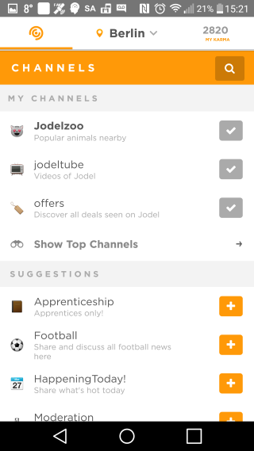

| Functional User | Sub-process Description                                      | Data Group    | Data Mvmt Type | CFP  |
| ------------------- | ------------------------------------------------------------ | ------------- | ---------------------- | ---- |
| User                | The User clicks Channels button at the top left corner of the Feed screen. The App retrieves the list of User's Channels and the list of recommended Channels (most popular Channels not followed by the User). | Channel       | R                      | 2    |
| User                | The App displays the Channels screen with the list of User's Channels and the list of recommended Channels . If there are new unread Jodels in one of the User's Channels, its name is written in boldface and goes to the top of the list. | Channel       | X                      | 2    |
| User                | App displays error message.                                  | Error message | X                      | 1    |

**Total: 9 CFP**

#### Display Channel Feed

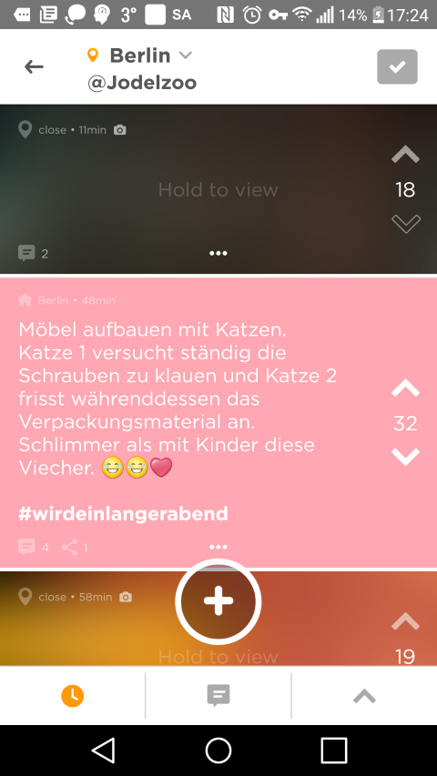

| Functional User | Sub-process Description                                      | Data Group    | Data Mvmt Type | CFP  |
| ------------------- | ------------------------------------------------------------ | ------------- | ---------------------- | ---- |
| User                | User clicks on Channel he wants to read.                     | Channel       | E                      | 1    |
|                     | App retrieves the Channel Feed:  &bullet; **Newest**: Up to 150 Jodels within the dynamic radius, from the chosen Channel, sorted in reverse chronological order.  &bullet; **Most Discussed**: Up to 150 Jodels within the dynamic radius, from the chosen Channel, posted in the last 7 days, ordered by reply count descending.  &bullet; **Loudest**: Up to 150 Jodels within the dynamic radius, from the chosen Channel, posted in the last 7 days, ordered by vote count descending. | Jodel         | R                      | 3    |
| User                | **Display Feed**.                                            | Post          |                        | 0    |
| User                | App displays error message.                                  | Error message | X                      | 1    |

**Total: 4 CFP**

#### Display Hashtag Feed

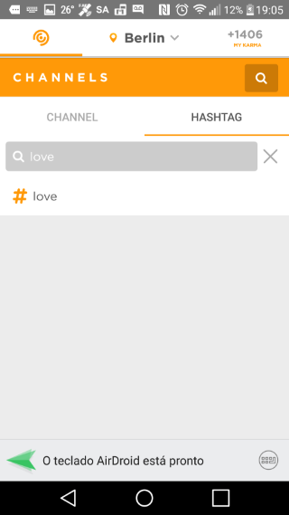

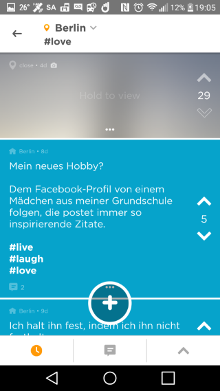

| Functional User | Sub-process Description                                      | Data Group    | Data Mvmt Type | CFP  |
| ------------------- | ------------------------------------------------------------ | ------------- | ---------------------- | ---- |
| User                | On Channels screen, User clicks on the magnifying glass as if searching for a Channel. A bar will show up where the User can switch the search to hashtags instead of Channels. The User then types the hashtag on the search box. The button with the hashtag will show up 3 seconds after the User finishes typing. The User then clicks on the hashtag button to begin searching. | Hashtag       | E                      | 1    |
|                     | App retrieves the Hashtag Feed. The hashtag can occur in the reply, but only parent Jodels are retrieved:  &bullet; **Newest**: Posts within the dynamic radius, with the chosen hashtag, sorted in reverse chronological order.  &bullet; **Most Discussed**: Posts within the dynamic radius, with the chosen hashtag, ordered by reply count descending.  &bullet; **Loudest**: Posts within the dynamic radius, with the chosen hashtag, ordered by vote count descending. | Jodel         | R                      | 3    |
|                     | **Display Feed**.                                            | Jodel         |                        |      |
| User                | App displays error message                                   | Error message | X                      | 1    |

**Total: 5 CFP**

#### Search a Channel

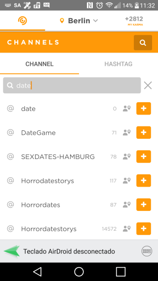

| Functional User | Sub-process Description                                      | Data Group    | Data Mvmt Type | CFP  |
| ------------------- | :----------------------------------------------------------- | ------------- | :--------------------- | ---- |
| User                | On Channels screen, User clicks on the magnifying glass. The User types on the search box. | Channel Name  | E                      | 1    |
|                     | While the User types, the App searches existing channels that match the search. | Channel       | R                      | 1    |
| User                | While searching, the App displays the result of the search. The counter at the right shows how many Users in the dynamic area are currently following the channel. | Channel       | X                      | 1    |
| User                | App displays error message                                   | Error message | X                      | 1    |

**Total: 4 CFP**

#### Follow / Unfollow Channel

| Functional User | Sub-process Description                                      | Data Group    | Data Mvmt Type | CFP  |
| ------------------- | ------------------------------------------------------------ | ------------- | ---------------------- | ---- |
| User                | On a Channel Display, the User clicks + to follow or ✓ to unfollow a Channel. | Channel       | E                      | 1    |
|                     | App updates data base.                                       | User, Channel | W                      | 1    |
|                     | App updates Channel Display.                                 | Channel       | X                      | 1    |
| User                | App displays error message.                                  | Error message | X                      | 1    |

**Total: 4 CFP**

### Interacting with User Profile

#### Set Location

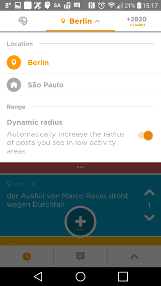

| Functional User | Sub-process Description                                      | Data Group            | Data Mvmt Type | CFP  |
| ------------------- | ------------------------------------------------------------ | --------------------- | ---------------------- | ---- |
| Location Service    | App gets User current Location.                              | User Location         | E                      | 1    |
|                     | App retrieves User Hometown.                                 | User Location         | E                      | 1    |
| User                | User select between current location or hometown on drop down city menu. | City                  | E                      | 1    |
|                     | App updates User Location                                    | User Location         | W                      | 1    |
|                     | App retrieves the nearest 150 Jodels in order to determine the dynamic radius. | Post, Dynamic  Radius | R                      | 1    |
| User                | App displays error message.                                  | Error message         | X                      | 1    |

**Total: 6 CFP**

#### Set Hometown

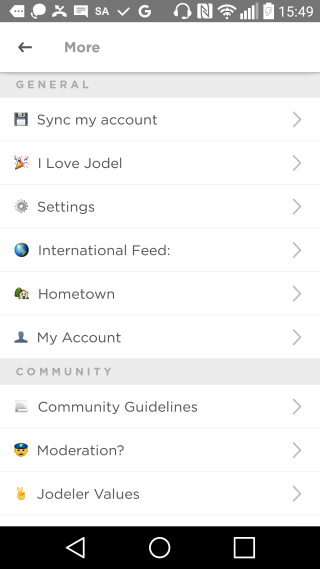

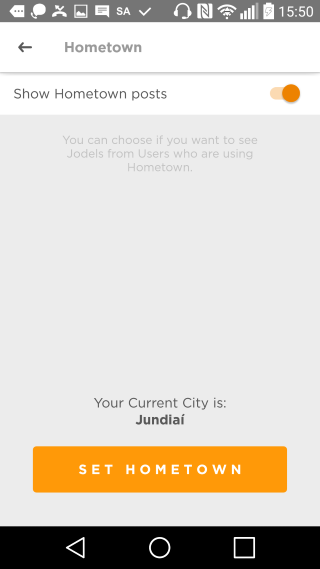

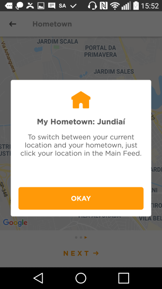

| Functional User | Sub-process Description                                      | Data Group      | Data Mvmt Type | CFP  |
| ------------------- | ------------------------------------------------------------ | --------------- | ---------------------- | ---- |
| User                | From ME Screen, User selects More. From More Screen, User selects Hometown. In order to set the Hometown, **the User needs to be physically present in that location** to save it once and for all. The user can reset the Hometown **only once per month**. | Control Command | E                      | 1    |
|                     | App retrieves User current Hometown.                         | User Hometown   | R                      | 1    |
| Location Service    | App gets User current Location.                              | Location        | E                      | 1    |
| User                | App displays current City as the new Hometown. User confirms. | City            | X                      | 1    |
|                     | App updates the User Hometown.                               | User Hometown   | W                      | 1    |
| User                | App displays error message.                                  | Error message   | X                      | 1    |

**Total: 6 CFP**

#### Display My Profile

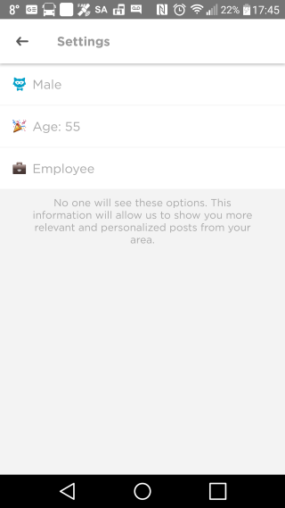

| Functional User | Sub-process Description                        | Data Group      | Data Mvmt Type | CFP  |
| ------------------- | ---------------------------------------------- | --------------- | ---------------------- | ---- |
| User                | From More Screen, the User selects My Account. | Control Command | E                      | 1    |
|                     | App retrieves User Profile.                    | User Profile    | R                      | 1    |
| User                | App displays User Profile.                     | User Profile    | X                      | 1    |
| User                | App displays error message.                    | Error message   | X                      | 1    |

**Total: 4 CFP**

## Suggestion for MVP

As a suggestion, the following features can be left out from MVP:

* Dynamic radius, maybe we should start with a fixed radius of 100 km;

* Share a Jodel;

* Pin a Jodel;

* Give thanks;

* Video posts;

* Notifications;

* Channels;

* Hometown;

* Boosted Posts;

* Jodel Display (full page ads).

## Standards and Technologies

### GitHub

The project must be done in two private GitHub repositories: one for the application server and other for the mobile application.

### Test Coverage

The project must use a test coverage tool.

The minimum acceptable code coverage is 91%.

### Database

The project should use MongoDB as the preferred database and Mongoose as the preferred ODM.

### Application Server

The application server must be implemented using a GraphQL API running on Nodejs.

The application server will be deployed to DigitalOcean.

#### Deployment

The development team will install MongoDB and NodeJS in the DigitalOcean cloud server.

The development team must supply a deployment script to setup the environment and install the application server in the DigitalOcean cloud server.

The deployment script must:

* Download the project from GitHub;

* Install dependencies;

* Create a service to execute the application server;

* Setup the database.

The development team should provide in `readme.md` the commands to:

* Start the service;
* Pause the service;
* Restart the service;
* Keep track of the service log.

### Mobile Application

The mobile application must be implemented using Ionic React and single code base to run on Android and IOS devices.

#### Distribution

The mobile application must be distributed through:

* Google Play Store to Android devices;
* Apple App Store to IOS devices.

