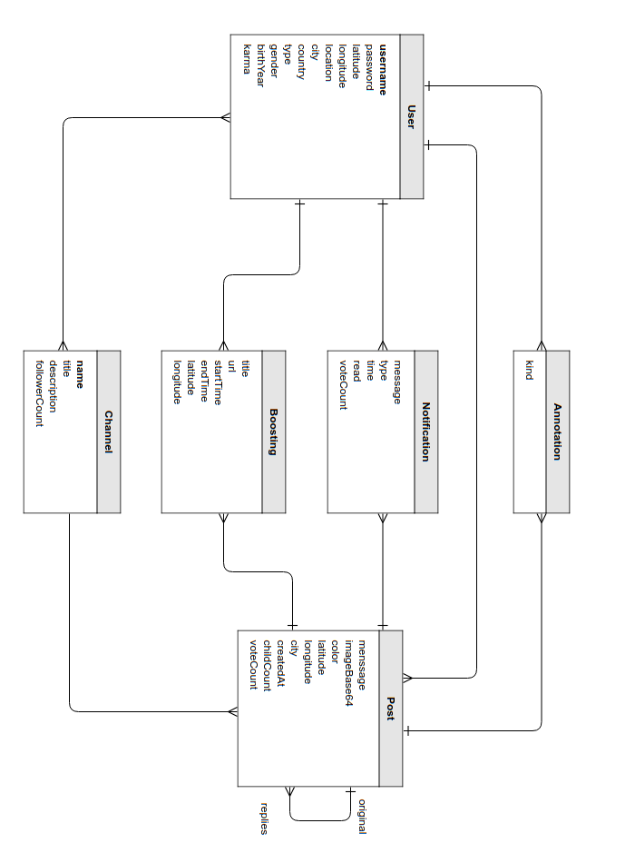
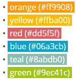

# Our Jodel: Conceptual Design
## Data Model

### Entity-Relationship Diagram

### Data Dictionary

#### Post

| Attribute   | Description                                                  |
| ----------- | ------------------------------------------------------------ |
| message     | Text can have length up to 240 characters.                   |
| imageBase64 | Image encoded base 64.                                       |
| color       | The color has no actual meaning. The color is selected randomly when the user press the &ldquo;+&rdquo; button.  Posts can have six colors:  |
| latitude    | Signed latitude of the location of posting, in degrees, with precision of 5 decimal places. |
| longitude   | Signed longitude of the location of posting, in degrees, with precision of 5 decimal places. |
| distance    | One of the following: &bull; here (less than 1 km) &bull; very-close (between 1 and 2 km) &bull; close (between 2 and 10 km) &bull; far (more than 10 km) &bull; hometown (posted from a different location using hometown feature)  For distances less than 1000 kilometers, the distance in kilometers between two points located at (&phi;0, &lambda;0) and (&phi;1, &lambda;1) can be calculated with very good accuracy by the following simple formula:    For instance, the distance between  Praça da Sé in São Paulo, at (-23.5503&deg;, -46.6334&deg;) and  Praça XV in Rio de Janeiro, at (-22.9028&deg;, -43.1733&deg;),  calculated using the above formula we get 360.0 km.  Using the more accurate Haversine formula, we get 360.8 km. |
| city        | Name of the city. e.g.: São Paulo                            |
| createdAt   | Date-time of the post                                        |
| childCount  | For original post, it is the number of replies. For replies, it is 0. |
| voteCount   | number of upvotes minus number of downvotes.  When a post has voteCount of -5 it disappears. |

#### User

| Attribute      | Description                                                  |
| -------------- | ------------------------------------------------------------ |
| **email**      | Email address.                                               |
| activationCode | Activation code.                                             |
| latitude       | Signed latitude of user's location, in degrees, with precision of 5 decimal places. |
| longitude      | Signed longitude of the user's location, in degrees, with precision of 5 decimal places. |
| location       | Name of the user's location, normally equals to the name of the city. |
| city           | Name of the city of the the user's location, e.g.: São Paulo |
| country        | Two letter country code, e.g. BR                             |
| type           | User's type. Users can have one of 6 types: &bull; Aprendiz &bull; Funcionário &bull; Colegial &bull; Vestibulando &bull; Universitário &bull; Outros |
| gender         | &ldquo;m&rdquo; or &ldquo;f&rdquo;                           |
| birthyear      | User's birthyear with 4 digits.                              |
| karma          | User's score:   &bull; The user earns (looses) 2 karma for upvoting (downvoting) on a post  &bull; The user earns (looses) 10 karma when he receives an upvote (downvote)  &bull; The user earns 1 karma for thanking another user who replies to his post  &bull; The replier earns 5 karma for receiving thanks. |

#### Remark

| Attribute | Description                                                  |
| --------- | ------------------------------------------------------------ |
| kind      | One of the following: &bull; upvote: an upvote cancels previous downvote from the user &bullet; downvote: an downvote cancels previous upvote from the user &bullet; subscribe: when the user posts an original post, reply or pin a thread he gets automatically subscribed &bullet; thank: the author can thank for a reply from another user &bullet; pin. |

#### Notification

| Attribute | Description                                                  |
| --------- | ------------------------------------------------------------ |
| type      | One of the following: &bullet; ReplyOnReply: a reply was posted on a thread, after the user has replied on the same thread &bullet; ReplyOnOriginal: a reply was posted on a thread originated from a user's post &bullet; VoteOnPost: vote on a post of this user &bullet; ReplyOnPin: a reply was posted on a thread pinned by this user |
| read      | Flag to signal that the notification has been read.          |
| time      | Date and time of the event.                                  |

#### BoostedPostPlacement

| Attribute | Description                                                  |
| --------- | ------------------------------------------------------------ |
| title     | The title of the boosted post.  The post will be boosted in the area of a 10 km radius circle around the point of placement. In each area, there can be only one boosted post at a time. Therefore the distance between two simultaneous boosted posts should always be longer than 20 km. |
| url       | The URL of the ad.                                           |
| startTime | Date and time of the placement.                              |
| endTime   | Date and time of the removal.                                |
| latitude  | This is the signed latitude of the point of placement, in degrees, with precision of 5 decimal places. |
| longitude | This is the signed longitude of the point of the placement, in degrees, with precision of 5 decimal places. |
| canReply  | Flag to enable replies to this placement.                    |

#### Channel

| Attribute     | Description                                                  |
| ------------- | ------------------------------------------------------------ |
| **name**      | Unique identifier of channel, CamelCase style.  At first, users will not be able to create their own channels, but will be able to post and follow the ones we will create. Like everything in Jodel, the channels will also have local coverage. When a user follows a channel, everything others post to the channel within the 10km radius circle will automatically appear in his home feed. Here are some channels we consider important for every local community: &bullet; **PerguntasLocais**: This is a part of this local community that aims to deliver a great local question & answer experience. What was the loud noise 2 minutes ago all about? Why do all people nearby suddenly wear red sneakers? This is a place to help each other and satisfy users' curiosity. &bullet; **CommunidadeAnimal** is the home for all of our pet lovers. Here users can get their daily dose of cuteness to get them through a rough day. &bullet; **AcontecendoHoje!** is the place where fellow users keep each other updated about cool stuff to do in their area. Is there any awesome show in your neighborhood? A new shop is opening up? |
| description   | Description of this channel.                                 |
| followerCount | Count of the number of users in the local area that are currently following this channel. |

## Functional Processes

### Signup

| Functional User | Sub-process Description                                  | Data Group                   | Data Mvmt Type | CFP  |
| ------------------- | ------------------------------------------------------------ | ---------------------------- | ---------------------- | ---- |
| User                | User enters his details                                      | User                         | E                      | 1    |
|                     | Server validates the entered data and checks if the User already exists | User                         | R                      | 1    |
| E-mail provider | Server sends activation code to the User's email             | Activation record            | X                      | 1    |
|                     | Server creates a new User                                    | User                         | W                      | 1    |
| User                | App displays confirmation/error message                      | Confirmation  /Error message | X                      | 1    |

**Total: 5  CFP**

### Activate App

| Functional User | Sub-process Description                    | Data Group                    | Data Mvmt Type | CFP  |
| --------------- | ------------------------------------------ | ----------------------------- | -------------- | ---- |
| User            | User enters Activation Record              | Activation Record             | E              | 1    |
|                 | Server authenticates the Activation Record | Activation Record             | R              | 1    |
|                 | App save Activation Record in the device   | Activation Record             | W              | 1    |
| User            | App displays confirmation/error message    | Confirmation  / Error message | X              | 1    |

**Total: 4 CFP**

### Initialize App

| Functional User  | Sub-process Description                                      | Data Group         | Data Mvmt Type | CFP  |
| ---------------- | ------------------------------------------------------------ | ------------------ | -------------- | ---- |
| User             | User starts App.                                             | Control Command    | E              | 1    |
|                  | App retrieves the Activation Record.                         | Activation Record  | R              | 1    |
|                  | Server authenticates the User's Activation Record and returns a JWT Access Token, valid for 24 hours. | User, Access Token | R              | 1    |
|                  | App saves the Access Token in the device storage. The App will send the Access Token in the authentication header of the HTTP requests: &ldquo;Authentication: Bearer {token}&rdquo;. This authorizes the User for seeing posts, voting, posting etc. | Access Token       | W              | 1    |
| Location Service | App gets User Location                                       | User Location      | E              | 1    |
|                  | Server updates User Location                                 | Device Location    | W              | 1    |
| User             | App displays error message                                   | Error message      | X              | 1    |

**Total: 7 CFP**

### Display Recent Feed

| Functional User | Sub-process Description                                      | Data Group                                                   | Data Mvmt Type | CFP  |
| --------------- | ------------------------------------------------------------ | ------------------------------------------------------------ | -------------- | ---- |
| User            | User demands to see recent feed                              | Control Command                                              | E              | 1    |
|                 | Server gets original posts close to the user ordered by date-time descending.  Load 10 posts at a time as the user scrolls through the feed screen. If there is less than 10 close posts, append far posts from the country. If there is a boosted post in the area, put it on top. | Post                                                         | R              | 4    |
| User            | Display the list of Posts. Don't display figures, only &ldquo;Hold to view&rdquo; button. | distance, time, message, vote count, reply count, sharing count  | X              | 1    |
| User            | System displays error message                                | Error message                                                | X              | 1    |

**Total: 7 CFP**

### Display Popular Feed

| Functional User | Sub-process Description                                      | Data Group                                                   | Data Mvmt Type | CFP  |
| --------------- | ------------------------------------------------------------ | ------------------------------------------------------------ | -------------- | ---- |
| User            | User selects to see popular feed.                            | Control Command                                              | E              | 1    |
|                 | Server gets original posts close to the User ordered by votes descending. Load 10 posts at a time as the user scrolls through the feed screen.  If there is less than 10 close posts, append far posts. If there is a boosted post in the area, put it on top. | Post                                                         | R              | 4    |
| User            | Display the list of Posts. Don't display figures, only “Hold to view” button. | distance, time, message, vote count, reply count, sharing count | X              | 1    |
| User            | System displays error message                                | Error message                                                | X              | 1    |

**Total 7 CFP**

### Display My Votes Feed

| Functional User | Sub-process Description                                      | Data Group                                                   | Data Mvmt Type | CFP  |
| --------------- | ------------------------------------------------------------ | ------------------------------------------------------------ | -------------- | ---- |
| User            | User selects to see My Votes Feed                            | Control Command                                              | E              | 1    |
|                 | Server gets original posts upvoted by the User ordered by date-time descending. Load 10 posts at a time as the user scrolls through the feed screen. | Post                                                         | R              | 2    |
| User            | Display the list of Posts. Don't display figures, only “Hold to view” button. | distance, time, message, vote count, reply count, sharing count | X              | 1    |
| User            | System displays error message                                | Error message                                                | X              | 1    |

**Total: 5 CFP**

### Display My Replies Feed

| Functional User | Sub-process Description                                      | Data Group                                                   | Data Mvmt Type | CFP  |
| --------------- | ------------------------------------------------------------ | ------------------------------------------------------------ | -------------- | ---- |
| User            | User selects to see My Replies Feed                          | Control Command                                              | E              | 1    |
|                 | Server gets original posts that the User replied ordered by date-time descending. Load 10 posts at a time as the user scrolls through the feed screen. | Post                                                         | R              | 2    |
| User            | Display the list of Posts.  Don't display figures, only “Hold to view” button. | distance, time, message, vote count, reply count, sharing count | X              | 1    |
| User            | System displays error message                                | Error message                                                | X              | 1    |

**Total: 5 CFP**

### Display My Pins Feed

| Functional User | Sub-process Description                                      | Data Group                                                   | Data Mvmt Type | CFP  |
| --------------- | ------------------------------------------------------------ | ------------------------------------------------------------ | -------------- | ---- |
| User            | User selects to see My Pins Feed                             | Control Command                                              | E              | 1    |
|                 | Server gets original posts the User pinned ordered by date-time descending. Load 10 posts at a time as the user scrolls through the feed screen. | Post                                                         | R              | 2    |
| User            | Display the list of Posts. Don't display figures, only “Hold to view” button. | distance, time, message, vote count, reply count, sharing count | X              | 1    |
| User            | System displays error message                                | Error message                                                | X              | 1    |

**Total 5 CFP**

### List a Channel

| Functional User | Sub-process Description                                      | Data Group                                                   | Data Mvmt Type | CFP  |
| --------------- | ------------------------------------------------------------ | ------------------------------------------------------------ | -------------- | ---- |
| User            | User selects to see posts.                                   | Control Command                                              | E              | 1    |
|                 | Server gets original posts of a channel, posted close to the User, ordered by date-time descending. Load 10 posts at a time as the user scrolls through the feed screen. If there is less than 10 close posts, append far posts. If there is a boosted post of the channel in the area, put it on top. | Post                                                         | R              | 4    |
| User            | Display the list of Posts.  Don't display figures, only “Hold to view” button. | distance, time, message, vote count, reply count, sharing count | X              | 1    |
| User            | System displays error message                                | Error message                                                | X              | 1    |

**Total 7 CFP**

