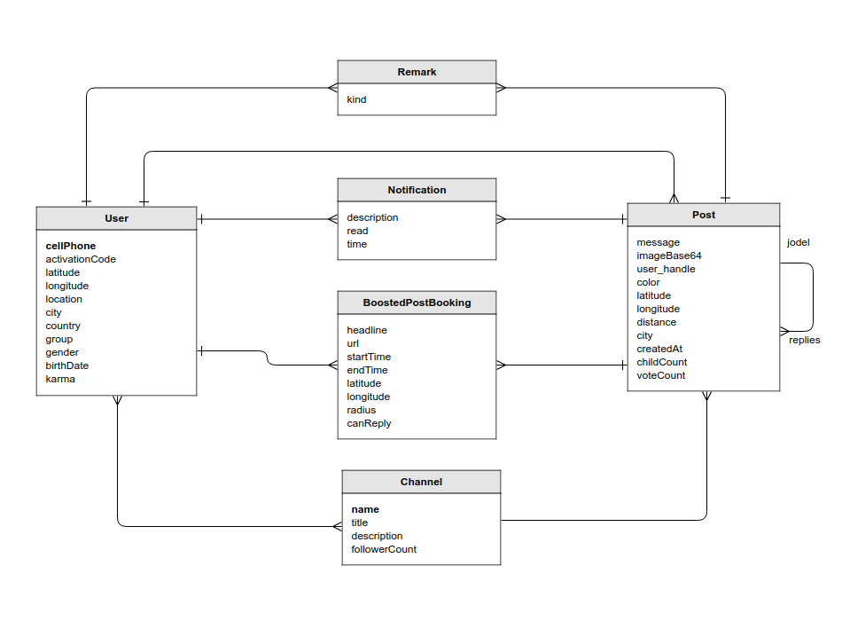

# Our Jodel: Conceptual Design
## Data Model

### Entity-Relationship Diagram

### Data Dictionary

#### Post

| Attribute  | Description                                                  |
| ---------- | ------------------------------------------------------------ |
| content    | Probably, we are going to use MIME format. Text can have length up to 240 characters. |
| color      | The color has no actual meaning. The color is selected randomly when the user press the &ldquo;+&rdquo; button. Posts can have six colors: &bull; orange (#FF9908) &bull; yellow (#FFBA00) &bull; red (#DD5F5F) &bull; blue (#06A3CB) &bull; blueish-grey (#8ABDB0) &bull; green (#9EC41C) |
| latitude   | Signed latitude of the location of posting, in degrees, with precision of 5 decimal places. |
| longitude  | Signed longitude of the location of posting, in degrees, with precision of 5 decimal places. |
| distance   | One of the following: &bull; here (less than 1 km) &bull; very-close (between 1 and 2 km) &bull; close (between 2 and 10 km) &bull; far (more than 10 km) &bull; hometown (posted from a different location using hometown feature) |
| city       | Name of the city. e.g.: São Paulo                            |
| createdAt  | Date-time of the post                                        |
| childCount | For original post, it is the number of replies. For replies, it is 0. |
| voteCount  | number of upvotes minus number of downvotes.  When a post has voteCount of -5 it disappears. |

#### User

| Attribute | Description                                                  |
| --------- | ------------------------------------------------------------ |
| username  | Login e-mail address.                                        |
| password  | Login password.                                              |
| latitude  | Signed latitude of user's location, in degrees, with precision of 5 decimal places. |
| longitude | Signed longitude of the user's location, in degrees, with precision of 5 decimal places. |
| location  | Name of the user's location, normally equals to the name of the city. |
| city      | Name of the city of the the user's location, e.g.: São Paulo |
| country   | Two letter country code, e.g. BR                             |
| type      | User's type. Users can have one of 6 types: &bull; Aprendiz &bull; Funcionário &bull; Colegial &bull; Vestibulando &bull; Universitário &bull; Outros |
| gender    | &ldquo;m&rdquo; or &ldquo;f&rdquo;                           |
| birthyear | User's birthyear with 4 digits.                              |
| karma     | User's score:   &bull; The user earns (looses) 2 karma for upvoting (downvoting) on a post  &bull; The user earns (looses) 10 karma when he receives an upvote (downvote)  &bull; The user earns 1 karma for thanking another user who replies to his post  &bull; The replier earns 5 karma for receiving thanks. |

#### Remark

| Attribute | Description                                                  |
| --------- | ------------------------------------------------------------ |
| kind      | One of the following: &bull; upvote: an upvote cancels previous downvote from the user &bullet; downvote: an downvote cancels previous upvote from the user &bullet; subscribe: when the user posts an original post, reply or pin a thread he gets automatically subscribed &bullet; thank: the author can thank for a reply from another user &bullet; pin. |

#### Notification

| Attribute | Description                                                  |
| --------- | ------------------------------------------------------------ |
| type      | Any of the following: &bullet; reply_on_reply: a reply was posted on a thread, after the user has replied on the same thread &bullet; reply_on_original: a reply was posted on a thread originated from a user's post &bullet; vote_on_post: vote on a post of this user &bullet; reply on pin: a reply was posted on a thread pinned by this user |
| read      | Flag to signal that the notification has been read.          |
| time      | Date and time of the event.                                  |

#### Boost

| Attribute | Description                                                  |
| --------- | ------------------------------------------------------------ |
| title     | The title of the ad.                                         |
| url       | The URL of the ad.                                           |
| startTime | Start date and time of the placement.                        |
| endTime   | End date and time of the placement.                          |
| latitude  | Signed latitude of center of the area, in degrees, with precision of 5 decimal places. The post will be boosted in a area within 10 km of the center. |
| longitude | Signed longitude of center of the area, in degrees, with precision of 5 decimal places. The post will be boosted in a area within 10 km of the center. |
| canReply  | Flag to enable replies to this placement.                    |

