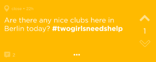
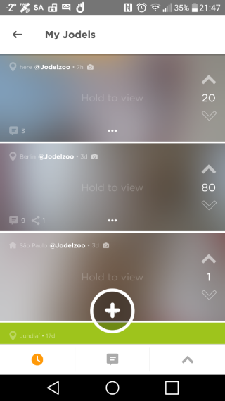
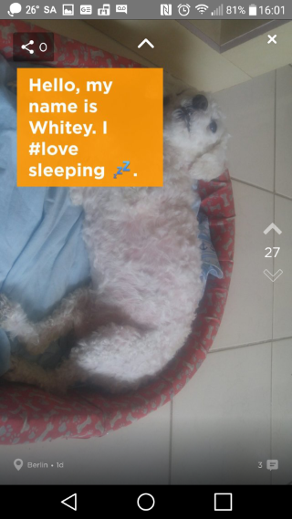
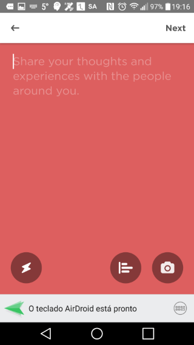
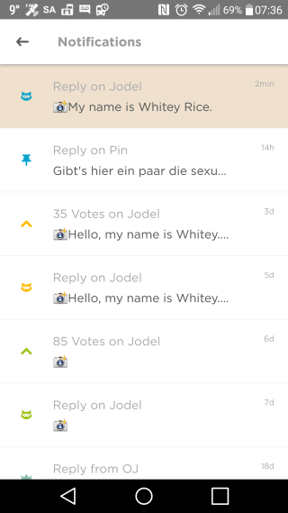
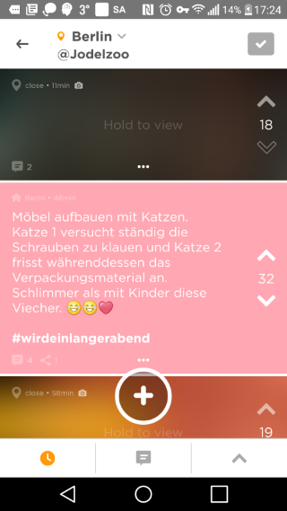
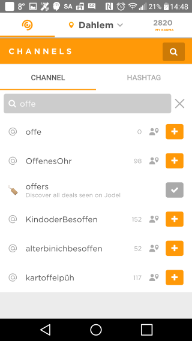
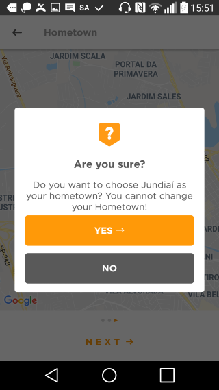

# Our Jodel: Conceptual Design
## Data Model

### Entity-Relationship Diagram

### Data Dictionary

#### Post

A *Post* is a message, picture or video (up to 20 seconds) that is published by a User.

A *Jodel* is the initial Post that may start a thread.

A *Reply* is a Post written in answer or response to a Jodel.

| Attribute   | Description                                                  |
| ----------- | ------------------------------------------------------------ |
| message     | Text can have a length of up to 240 characters.              |
| imageBase64 | Image encoded base 64. It can be a short video, up to 20 seconds. |
| user_handle | This is a number uniquely identifies the posting user in the thread, i.e. when the first replier makes another reply on the same Jodel, that reply will have the same user_handle as the first. However, the user_handle is not unique for every user in every thread, i.e. when a replier makes another reply on a different Jodel, that reply will have a different user_handle. In other words, it is possible to know which replies on a Jodel was made by the same user, but it is not possible to reconstruct a user's Jodel activities from long-time observations. The *Original Jodeler* is the user who posted the initial Jodel. His user_handle is 0, and his posts on the thread are identified by the initials OJ. |
| color       | The color has no actual meaning. The color of a Jodel is selected randomly when the user clicks the &ldquo;+&rdquo; button. The color of a Reply is always the same as the color of the parent Jodel. Posts can have seven colors:  |
| latitude    | Signed latitude of the location of posting, in degrees, with a precision of 5 decimal places. |
| longitude   | Signed longitude of the location of posting, in degrees, with a precision of 5 decimal places. |
| distance    | One of the following: &bull; **here**: less than 1 km; &bull; **very-close**: between 1 and 2 km; &bull; **close**: between 2 and 10 km; &bull; **far**: more than 10 km; &bullet; **hometown**: if posted using the *hometown* feature. The *hometown* feature allows users to read and write posts in a place they are not currently in. However, this location must be set once by the user and then it can only be changed once in a month. Only the current location of the user can be set as his hometown.  At first, only posts posted within a 10 km radius are shown in the feed. When there are many users in the area, the users enjoy a lot of activity; less populated areas, on the contrary, can spot tumbleweed in their less engaged feeds. To mitigate this issue we introduce the *dynamic radius* feature. With the dynamic radius, the radius will be increased in 10 km steps until the area has more than 150 Jodels or the radius reach 100 km.   The distance in kilometers between two points located at (&phi;0, &lambda;0) and (&phi;1, &lambda;1), where latitude &phi; and longitude &lambda; are in degrees,  can be calculated by the following approximate formula:    This approximation is very fast and produces a fairly accurate result for small distances. Also in ordering locations by distance, it is much faster to order by squared distance eliminating the need for computing the square root. For instance, the distance between  Praça da Sé in São Paulo, at (-23.5503&deg;, -46.6334&deg;) and  Praça XV in Rio de Janeiro, at (-22.9028&deg;, -43.1733&deg;),  using the above formula, is 360.0 km.  Using an [accurate geodesic calculator](https://geographiclib.sourceforge.io/cgi-bin/GeodSolve?type=I&input=-23.5503+-46.6334+-22.9028+-43.1733&format=g&azi2=f&unroll=r&prec=3&radius=6378137&flattening=1%2F298.257223563&option=Submit), the distance is 361.1 km. |
| city        | Name of the city. e.g.: São Paulo                            |
| createdAt   | Date-time of the post                                        |
| childCount  | For Jodel, it is the number of replies. For replies, it is null. |
| voteCount   | number of upvotes minus number of downvotes.  When a post has voteCount of -5 it disappears. |

#### User

| Attribute      | Description                                                  |
| -------------- | ------------------------------------------------------------ |
| **cellphone**  | Cell phone number.                                           |
| activationCode | Activation code.                                             |
| latitude       | Signed latitude of user's location, in degrees, with a precision of 5 decimal places. |
| longitude      | Signed longitude of the user's location, in degrees, with a precision of 5 decimal places. |
| location       | Name of the user's location normally equals to the name of the city. |
| city           | Name of the city of the user's location, e.g.: São Paulo     |
| country        | Two-letter country code, e.g. BR                             |
| group          | &bull; **Aprendiz** &bull; **Funcionário** &bull; **Colegial** &bull; **Vestibulando** &bull; **Universitário** &bull; **Pós-graduando** &bullet; **Empresário / Autônomo** &bullet; **Servidor Público** &bullet; **Aposentado** |
| gender         | &bullet; **male**  &bullet; **female**  &bullet; **other** |
| birthdate      | User's birthdate.                                            |
| karma          | User's score:   &bull; the user earns (looses) 2 karma for upvoting (downvoting) on a post  &bull; the user earns (looses) 10 karma when he receives an upvote (downvote)  &bull; the user earns 1 karma for thanking another user who replies to his post  &bull; the replier earns 5 karma for receiving thanks. |

#### Remark

| Attribute | Description                                                  |
| --------- | ------------------------------------------------------------ |
| kind      | One of the following: &bull; **upvote** &bullet; **downvote** &bullet; **subscribe**: the user will receive push notifications on any updates to the subscribed Jodels. When the user posts Jodels and Replies, they are automatically subscribed; &bullet; **thank**: the OJ can thank for a reply from another user, after upvoting it; &bullet; **pin**: It allows the user to save and follow the Jodel. The user will receive push notifications on any updates to the pinned Jodels. The pinned Jodels will be visible in the &ldquo;My Pins&rdquo; section. |

#### Notification

Push notifications are emitted in the background on events occurring on the Jodel you subscribed or pinned.

| Attribute   | Description                                                  |
| ----------- | ------------------------------------------------------------ |
| description | It describes which event occurred: &bullet; **Reply from OJ**: OJ replied on the Jodel; &bullet; **Thanks from OJ**: A reply of the user has received thanks; &bullet; **Reply on Jodel**: A reply was posted. |
| read        | Flag to signal that the notification has been read.          |
| time        | Date and time of the event.                                  |

#### BoostedPostBooking

A *boosted post* is a paid ad post.

In each area, there can be only one boosted post at a time. 

The boosted post appears first in the user's feed.

Each boosted post is a regular post, thus users can vote or reply on it (replying can be optionally disabled by the poster). The only difference: if the user downvote it, the boosted post will disappear for the user.

| Attribute | Description                                                  |
| --------- | ------------------------------------------------------------ |
| headline  | The headline of the URL. E.g.: **Jetzt Freikarte sichern!**  |
| url       | The URL of the ad. E.g.: https://www.vodafone.de/freikarten/callya-digital |
| startTime | Date and time of the booking.                                |
| endTime   | Date and time of the removal.                                |
| latitude  | This is the signed latitude of the point of placement, in degrees, with a precision of 5 decimal places. |
| longitude | This is the signed longitude of the point of the placement, in degrees, with a precision of 5 decimal places. |
| radius    | Boosted post coverage radius.                                |
| canReply  | Flag to enable replies to this placement.                    |

#### Channel

**Channels** are created to let  the user find more tailored content and participate in a community of users who share the same interests or talk about specific topics. 

Users will not be able to create their own channels, but they will be able to follow the ones we will create.

The feed will only show the Jodels from the main channel and the channels followed by the user.

| Attribute     | Description                                                  |
| ------------- | ------------------------------------------------------------ |
| **name**      | Unique identifier of the channel.                            |
| description   | Description of this channel.                                 |
| followerCount | Count of the number of users in the local area that are currently following this channel. |

## Functional Processes

### User Account Management

#### Signup

| Functional User | Sub-process Description                                      | Data Group                   | Data Mvmt Type | CFP  |
| ------------------- | ------------------------------------------------------------ | ---------------------------- | ---------------------- | ---- |
| User                | The user enters his details.                                 | User                         | E                      | 1    |
|                     | The server validates the entered data and checks if the user already exists. | User                         | R                      | 1    |
| SMS provider    | The server sends a text message with activation code,        | Activation record            | X                      | 1    |
|                     | The app waits text message with activation code returns.     | Activation Record            | R                      | 1    |
|                     | The app authenticates the Activation Record                  | Activation Record            | R                      | 1    |
|                     | The app creates a new User                                   | User                         | W                      | 1    |
|                     | The app save Activation Record in the device.                | Activation Record            | W                      | 1    |
|                     | **Initialize App**                                           |                              |                        |      |
| User                | The app displays confirmation/error message                  | Confirmation  /Error message | X                      | 1    |

**Total: 8  CFP**

#### Initialize App

| Functional User | Sub-process Description                                      | Data Group         | Data Mvmt Type | CFP  |
| ------------------- | ------------------------------------------------------------ | ------------------ | ---------------------- | ---- |
| User                | The user starts the app.                                     | Control Command    | E                      | 1    |
|                     | The app retrieves the Activation Record from the device storage. | Activation Record  | R                      | 1    |
|                     | The server authenticates the user's Activation Record and returns a JWT Access Token, valid for 24 hours. | User, Access Token | R                      | 1    |
|                     | The app saves the Access Token in the device storage. The app will send the Access Token in the authentication header of the HTTP requests: &ldquo;Authentication: Bearer {token}&rdquo;. This authorizes the user for seeing posts, voting, posting, etc. | Access Token       | W                      | 1    |
| User                | The app displays error message                               | Error message      | X                      | 1    |

**Total: 5 CFP**

### Reading Posts

#### Display Feed

| Functional User | Sub-process Description                                      | Data Group      | Data Mvmt Type | CFP  |
| ------------------- | ------------------------------------------------------------ | --------------- | ---------------------- | ---- |
| User                | A *Feed* consists of a set of three views listing Jodels only, no replies: &bullet; &#x1f553; **Newest**: up to 150 Jodels in reverse chronological order;  &bullet; &#x1f4ac; **Most discussed**: up to 150 Jodels ordered by child count descending;  &bullet;  ∧ **Loudest**: up to 150 Jodels ordered by vote count descending. The user can choose which view he wants to read by clicking one of the buttons at the bottom of the screen. The Feed is refreshed if the user swipes down on the first page. | Control Command | E                      | 1    |
| User                | The app displays a scrollable list of Jodels from the chosen view. | Jodel           | X                      | 2    |
| User                | The app displays error message                               | Error message   | X                      | 1    |

**Total: 4 CFP**

#### Display Main Feed

| Functional User | Sub-process Description                                      | Data Group                    | Data Mvmt Type | CFP  |
| ------------------- | ------------------------------------------------------------ | ----------------------------- | ---------------------- | ---- |
|                     | **Set Location**                                             | User Location, Dynamic Radius |                        |      |
|                     | App retrieves Main Feed:  &bullet; **Newest**: Up to 150 Jodels within the dynamic radius, from User's channels, sorted in reverse chronological order.  &bullet; **Most Discussed**: Up to 150 Jodels within the dynamic radius, from User's channels, posted in the last 7 days, ordered by reply count descending.  &bullet; **Loudest**: Jodels within the dynamic radius, from User's channels, posted in the last 7 days, ordered by vote count descending. | Jodel                         | R                      | 3    |
| User                | **Display Feed**.                                            | Post                          |                        |      |
| User                | The app displays Error message.                              | Error Message                 | X                      | 1    |

**Total: 4 CFP**

#### Display My Jodels Feed

| Functional User | Sub-process Description                                      | Data Group    | Data Mvmt Type | CFP  |
| ------------------- | ------------------------------------------------------------ | ------------- | ---------------------- | ---- |
| User                | User clicks on MY KARMA button, at upper right corner of main feed screen. The app displays ME screen. the user clicks on My Jodels button. | User          | E                      | 1    |
|                     | App retrieves My Posts Feed:  &bullet; **Newest**: Jodels posted by the user, sorted in reverse chronological order.  &bullet; **Most Discussed**: Jodels posted by the user, ordered by reply count descending.  &bullet; **Loudest**: Jodels posted by the user, ordered by vote count descending. | Jodel         | R                      | 3    |
| User                | **Display Feed**.                                            | Jodel         |                        |      |
| User                | The app displays error message                               | Error message | X                      | 1    |

**Total 5 CFP**

#### Display My Remarks

| Functional User | Sub-process Description                                      | Data Group    | Data Mvmt Type | CFP  |
| ------------------- | ------------------------------------------------------------ | ------------- | ---------------------- | ---- |
| User                | On ME screen, User clicks on My Replies, My Pins or My Votes button. | Remark Kind   | E                      | 1    |
|                     | The App retrieves posts in reverse chronological order according to the chosen remark kind:  &bullet; **reply**: Jodels the user replied . Note that the replies does not show up in this screen, only the Jodels that the user replied;  &bullet; **pin**: Jodels the user pinned;  &bullet; **vote**: Jodels the user upvoted. Note that, even the user upvoted a reply, only Jodels appear in this screen, | Jodel         | R                      | 1    |
| User                | Display the retrieved list.                                  | Post          | X                      | 1    |
| User                | The app displays error message                               | Error message | X                      | 1    |

**Total: 4 CFP**

#### Display Picture Feed

| Functional User | Sub-process Description                                      | Data Group    | Data Mvmt Type | CFP  |
| ------------------- | ------------------------------------------------------------ | ------------- | ---------------------- | ---- |
| User                | In Feed Screen, User hold button &ldquo;Hold to view&rdquo; , then Swipe up  to access Picture Feed. | Picture       | E                      | 1    |
|                     | App retrieves one picture at a time as User scrolls through the Picture Feed screen. | Picture       | R                      | 2    |
| User                | Display the current Picture with message overlaid at top left. Sponsored ads may be inserted in the Picture Feed. | Picture       | X                      | 2    |
| User                | The app displays error message.                              | Error message | X                      | 1    |

**Total: 6 CFP**

### Interacting with Single Posts

#### Create Jodel

| Functional User | Sub-process Description                                      | Data Group    | Data Mvmt Type | CFP  |
| ------------------- | ------------------------------------------------------------ | ------------- | ---------------------- | ---- |
| User                | User types message and clicks &ldquo;Next&rdquo;.            | Post Message  | E                      | 1    |
|                     | App retrieves User's channels and displays &ldquo;Post To&hellip;&rdquo;  to screen. | Channel       | R                      | 1    |
| User                | User selects the Channel to post and clicks the SEND button. | Channel       | E                      | 1    |
|                     | App creates Post.                                            | Jodel         | W                      | 1    |
|                     | **Display Feed**                                             |               |                        |      |
| User                | The app displays error message.                              | Error message | X                      | 1    |

**Total: 5 CFP**

#### Create Picture Jodel

| Functional User | Sub-process Description                                      | Data Group | Data Mvmt Type | CFP  |
| ------------------- | ------------------------------------------------------------ | ---------- | ---------------------- | ---- |
| User                | On Create Post Screen, User clicks 📷 button. the user takes a picture and clicks over the taken picture to type the Post message. | Jodel      | E                      | 1    |
|                     | **Create Jodel**                                             |            |                        |      |

**Total: 1 CFP**

#### Display Jodel Details

| Functional User | Sub-process Description                                      | Data Group           | Data Mvmt Type | CFP  |
| ------------------- | ------------------------------------------------------------ | -------------------- | ---------------------- | ---- |
| User                | On the Feed screen, User clicks on a Jodel.                  | Jodel                | E                      | 1    |
|                     | App retrieves the replies and the Notifications associated to the Jodel. | Reply , Notification | R                      | 2    |
|                     | App marks any existing Notification on the Jodel as read.    | Notification         | W                      | 1    |
| User                | The app displays the Jodel and a scrollable list of Replies. Note that each Reply on the list is labeled with the user_handle.  The Jodel Details Screen is refreshed if the user swipe down on the first page. | Reply                | X                      | 1    |
| User                | The app displays error message.                              | Error message        | X                      | 1    |

**Total:  6 CFP**

#### Send Reply

| Functional User | Sub-process Description                                      | Data Group        | Data Mvmt Type | CFP  |
| ------------------- | ------------------------------------------------------------ | ----------------- | ---------------------- | ---- |
| User                | The user types message and clicks Send button                | Reply Message | E                      | 1    |
|                     | App creates Reply.                                           | Reply             | W                      | 1    |
|                     | The app displays Jodel Details Screen with the reply added at the end. | Reply             | X                      | 1    |
| User                | The app displays error message.                              | Error message     | X                      | 1    |

**Total: 4 CFP**

#### Send Picture Reply

| Functional User | Sub-process Description                                      | Data Group        | Data Mvmt Type | CFP  |
| ------------------- | ------------------------------------------------------------ | ----------------- | ---------------------- | ---- |
| User                | On Jodel Details Screen, User clicks 📷 button. the user takes a picture, clicks over the taken picture to type the reply message. | Reply Picture | E                      | 1    |
|                     | **Send Reply**                                               | Reply             |                        |      |

**Total: 1 CFP**

#### Share a Jodel

| Functional User | Sub-process Description                                      | Data Group          | Data Mvmt Type | CFP  |
| ------------------- | ------------------------------------------------------------ | ------------------- | ---------------------- | ---- |
|                     | App retrieves sharing count.                                 | Jodel Sharing Count | R                      | 1    |
| User                | The app displays sharing count.                              | Jodel Sharing Count | X                      | 1    |
| User                | On Jodel Details Screen, User clicks  share button at the top right. | Jodel               | E                      | 1    |
|                     | App retrieves the share URL of the Jodel, that shows the parent Jodel and all the replies, messages and pictures. E.g.: https://shared.jodel.com/YTr85rK5l1 | URL                 | R                      | 1    |
| Sharing Service     | App sends the URL to the recipient.                          | URL                 | X                      | 1    |
|                     | App updates sharing count on the database.                   | Jodel               | W                      | 1    |
| User                | App updates sharing count display.                           | Jodel               | X                      | 1    |
| User                | The app displays error message.                              | Error message       | X                      | 1    |

**Total: 8 CFP**

#### Pin / Unpin a Jodel

| Functional User | Sub-process Description                                      | Data Group          | Data Mvmt Type | CFP  |
| ------------------- | ------------------------------------------------------------ | ------------------- | ---------------------- | ---- |
|                     | App retrieves pin count.                                     | Jodel Sharing Count | R                      | 1    |
| User                | The app displays pin count.                                  | Jodel Sharing Count | X                      | 1    |
| User                | On Jodel Details Screen, User clicks  share button at the top right. | Jodel               | E                      | 1    |
|                     | App updates the database.                                    | Jodel, Remark       | W                      | 1    |
| User                | App updates the pin display.                                 | Jodel               | X                      | 1    |
| User                | The app displays error message.                              | Error message       | X                      | 1    |

**Total: 6 CFP**

#### Upvote / Downvote a Post

| Functional User | Sub-process Description                                      | Data Group    | Data Mvmt Type | CFP  |
| ------------------- | ------------------------------------------------------------ | ------------- | ---------------------- | ---- |
| User                | On a Post Display, the user clicks ∧ or ∨ buttons to upvote or downvote a post. Each user can vote once for each post. | Post, Remark  | E                      | 1    |
|                     | App updates data base.                                       | Post, Remark  | W                      | 1    |
|                     | App updates Post Display.                                    | Post          | X                      | 1    |
| User                | The app displays error message.                              | Error message | X                      | 1    |

**Total: 4 CFP**

#### Give Thanks

| Functional User | Sub-process Description                                      | Data Group         | Data Mvmt Type | CFP  |
| ------------------- | ------------------------------------------------------------ | ------------------ | ---------------------- | ---- |
| User                | After OJ upvotes a reply, the ∧ becomes a ♡. The OJ clicks the ♡ to give thanks. | Post, Remark       | E                      | 1    |
|                     | App updates data base.                                       | Post, Remark, User | W                      | 1    |
|                     | App updates Post Display.                                    | Post               | X                      | 1    |
| User                | The app displays error message.                              | Error message      | X                      | 1    |

**Total: 4 CFP**

#### Enable / Disable Notifications

| Functional User | Sub-process Description                                      | Data Group    | Data Mvmt Type | CFP  |
| ------------------- | ------------------------------------------------------------ | ------------- | ---------------------- | ---- |
| User                | On Jodel Detail Screen, the user taps on the 3 dots (...) at the bottom of the Jodel. Then he selects &ldquo;Enable notifications&rdquo; or &ldquo;Disable notifications&rdquo;  to toggle notification status. | Post, Remark  | E                      | 1    |
|                     | App updates data base.                                       | Post, Remark  | W                      | 1    |
| User                | The app displays error message.                              | Error message | X                      | 1    |

**Total: 3 CFP**

#### Delete Post

| Functional User | Sub-process Description                                      | Data Group    | Data Mvmt Type | CFP  |
| ------------------- | ------------------------------------------------------------ | ------------- | ---------------------- | ---- |
| User                | On Jodel Detail Screen, the user taps on the 3 dots (...) at the bottom of his own Jodel or Reply. Then he selects &ldquo;Delete Jodel&rdquo;. | Post, Remark  | E                      | 1    |
|                     | App updates data base. When a Reply is deleted, the notifications status of the Jodel remains unchanged. When a Jodel is deleted, all the replies associated are also deleted. | Post, Remark  | W                      | 1    |
| User                | When a Reply is deleted, the App continues to display the Jodel Detail Screen. When a Jodel is deleted, the App returns to Main Feed Display. | Jodel, Reply  | X                      | 1    |
| User                | The app displays error message.                              | Error message | X                      | 1    |

**Total: 4 CFP**

### Interacting with Notifications

#### Push Notifications

| Functional User  | Sub-process Description                                      | Data Group   | Data Mvmt Type | CFP  |
| -------------------- | ------------------------------------------------------------ | ------------ | ---------------------- | ---- |
| Another User         | Another User replies on a Jodel.                             | Reply        | E                      | 1    |
|                      | Server checks the users who should receive push Notifications. | User, Remark | R                      | 1    |
|                      | Server creates and sends the Notifications.                  | Notification | W                      | 1    |
| Notification Service | The background process in each recipient device receives the notification and dispatches it to the Notification Service. | Notification | X                      | 1    |
| User                 | User opens Notification.                                     | Notification | E                      | 1    |
| Notification Service | App opens.                                                   | Notification | X                      | 1    |
|                      | **Display Jodel Details**                                    | Jodel        |                        |      |

**Total: 6 CFP**

#### Display Notification Center

| Functional User | Sub-process Description                                      | Data Group    | Data Mvmt Type | CFP  |
| ------------------- | ------------------------------------------------------------ | ------------- | ---------------------- | ---- |
| User                | On ME screen, User selects Notifications.                    | User          | E                      | 1    |
|                     | The app retrieves Notifications in reverse chronological order. | Notification  | R                      | 1    |
| User                | The app displays scrollable list of Notifications.           | Notification  | X                      | 1    |
|                     | The user opens a Notification,                               | Notification  | E                      | 1    |
|                     | **Display Jodel Details**                                    |               |                        |      |
| User                | The app displays error message                               | Error message | X                      | 1    |

**Total: 5 CFP**

### Interacting with Channels

#### Display Channels Screen

| Functional User | Sub-process Description                                      | Data Group    | Data Mvmt Type | CFP  |
| ------------------- | ------------------------------------------------------------ | ------------- | ---------------------- | ---- |
| User                | The user clicks Channels button at the top left corner of the Feed screen. The App retrieves the list of User's Channels and the list of recommended Channels (most popular Channels not followed by the user). | Channel       | R                      | 2    |
| User                | The The app displays the Channels screen with the list of User's Channels and the list of recommended Channels . If there are new unread Jodels in one of the user's Channels, its name is written in boldface and goes to the top of the list. | Channel       | X                      | 2    |
| User                | The app displays error message.                              | Error message | X                      | 1    |

**Total: 9 CFP**

#### Display Channel Feed

| Functional User | Sub-process Description                                      | Data Group    | Data Mvmt Type | CFP  |
| ------------------- | ------------------------------------------------------------ | ------------- | ---------------------- | ---- |
| User                | User clicks on Channel he wants to read.                     | Channel       | E                      | 1    |
|                     | App retrieves the Channel Feed:  &bullet; **Newest**: Up to 150 Jodels within the dynamic radius, from the chosen Channel, sorted in reverse chronological order.  &bullet; **Most Discussed**: Up to 150 Jodels within the dynamic radius, from the chosen Channel, posted in the last 7 days, ordered by reply count descending.  &bullet; **Loudest**: Up to 150 Jodels within the dynamic radius, from the chosen Channel, posted in the last 7 days, ordered by vote count descending. | Jodel         | R                      | 3    |
| User                | **Display Feed**.                                            | Post          |                        |      |
| User                | The app displays error message.                              | Error message | X                      | 1    |

**Total: 4 CFP**

#### Display Hashtag Feed

| Functional User | Sub-process Description                                      | Data Group    | Data Mvmt Type | CFP  |
| ------------------- | ------------------------------------------------------------ | ------------- | ---------------------- | ---- |
| User                | On Channels screen, User clicks on the magnifying glass. A bar will show up where the user can switch the search to hashtags instead of Channels. The user then types the hashtag on the search box. The button with the hashtag will show up 2 seconds after the user finishes typing. The user then clicks on the hashtag button to begin searching. | Hashtag       | E                      | 1    |
|                     | App retrieves the Hashtag Feed. The hashtag can occur in the reply, but only parent Jodels are retrieved:  &bullet; **Newest**: Posts within the dynamic radius, with the chosen hashtag, sorted in reverse chronological order.  &bullet; **Most Discussed**: Posts within the dynamic radius, with the chosen hashtag, ordered by reply count descending.  &bullet; **Loudest**: Posts within the dynamic radius, with the chosen hashtag, ordered by vote count descending. | Jodel         | R                      | 3    |
|                     | **Display Feed**.                                            | Jodel         |                        |      |
| User                | The app displays error message                               | Error message | X                      | 1    |

**Total: 5 CFP**

#### Search a Channel

| Functional User | Sub-process Description                                      | Data Group    | Data Mvmt Type | CFP  |
| ------------------- | :----------------------------------------------------------- | ------------- | :--------------------- | ---- |
| User                | On Channels screen, User clicks on the magnifying glass. the user types on the search box. | Channel Name  | E                      | 1    |
|                     | While the user types, the App searches existing channels that match the search. | Channel       | R                      | 1    |
| User                | While searching, the app displays the result of the search. The counter at the right shows how many Users in the dynamic area are currently following the channel. | Channel       | X                      | 1    |
| User                | The app displays error message                               | Error message | X                      | 1    |

**Total: 4 CFP**

#### Follow / Unfollow Channel

| Functional User | Sub-process Description                                      | Data Group    | Data Mvmt Type | CFP  |
| ------------------- | ------------------------------------------------------------ | ------------- | ---------------------- | ---- |
| User                | On a Channel Display, the user clicks + to follow or ✓ to unfollow a Channel. | Channel       | E                      | 1    |
|                     | App updates data base.                                       | User, Channel | W                      | 1    |
|                     | App updates Channel Display.                                 | Channel       | X                      | 1    |
| User                | The app displays error message.                              | Error message | X                      | 1    |

**Total: 4 CFP**

### Interacting with User Profile

#### Set Location

| Functional User | Sub-process Description                                      | Data Group            | Data Mvmt Type | CFP  |
| ------------------- | ------------------------------------------------------------ | --------------------- | ---------------------- | ---- |
| Location Service    | App gets User current Location.                              | User Location         | E                      | 1    |
|                     | App retrieves User Hometown.                                 | User Location         | E                      | 1    |
| User                | User select between current location or hometown on drop down city menu. | City                  | E                      | 1    |
|                     | App updates User Location                                    | User Location         | W                      | 1    |
|                     | App retrieves the nearest 150 Jodels in order to determine the dynamic radius. | Post, Dynamic  Radius | R                      | 1    |
| User                | The app displays error message.                              | Error message         | X                      | 1    |

**Total: 6 CFP**

#### Set Hometown

| Functional User | Sub-process Description                                      | Data Group      | Data Mvmt Type | CFP  |
| ------------------- | ------------------------------------------------------------ | --------------- | ---------------------- | ---- |
| User                | From ME Screen, User selects More. From More Screen, User selects Hometown. In order to set the Hometown, **the user needs to be physically present in that location** to save it once and for all. The user can reset the Hometown **only once per month**. | Control Command | E                      | 1    |
|                     | App retrieves User current Hometown.                         | User Hometown   | R                      | 1    |
| Location Service    | App gets User current Location.                              | Location        | E                      | 1    |
| User                | The app displays current location as the new Hometown. User confirms. | City            | X                      | 1    |
|                     | App updates the user Hometown.                               | User Hometown   | W                      | 1    |
| User                | The app displays error message.                              | Error message   | X                      | 1    |

**Total: 6 CFP**

#### Display My Profile

| Functional User | Sub-process Description                        | Data Group      | Data Mvmt Type | CFP  |
| ------------------- | ---------------------------------------------- | --------------- | ---------------------- | ---- |
| User                | From More Screen, the user selects My Account. | Control Command | E                      | 1    |
|                     | App retrieves User Profile.                    | User Profile    | R                      | 1    |
| User                | The app displays User Profile.                 | User Profile    | X                      | 1    |
| User                | The app displays error message.                | Error message   | X                      | 1    |

**Total: 4 CFP**

## Suggestion for MVP

As a suggestion, the following features can be left out from MVP:

* Dynamic radius, use a fixed radius of 100 km;
* Share a Jodel;
* Pin a Jodel;
* Give thanks;
* Video posts;
* Notifications;
* Channels;
* Hashtags;
* Hometown;
* Boosted posts;
* Sponsored ads.

According to functional process section, the MVP size would then be 65 CFP.

## Standards and Technologies

### GitHub

The project must be done in two private GitHub repositories: one for the application server and other for the mobile application.

### Test Coverage

The project must use a test coverage tool.

The minimum acceptable code coverage for unit testing is 90%.

### Database

The project should use MongoDB and Mongoose as the preferred database and ODM.

### Application Server

The application server must be implemented using a GraphQL API running on Nodejs.

Push notifications will be implemented using GraphQL subscriptions.

#### Deployment

The application server will be deployed to DigitalOcean cloud server.

The development team will install MongoDB and NodeJS in the server.

The development team must supply a deployment script to setup the environment and install the application server. The deployment script will run in DigitalOcean cloud server.

The deployment script must:

* Download the project from GitHub;

* Install dependencies;

* Create a service to execute the application server;

* Setup the database.

The development team should provide in `readme.md` the commands to:

* Start the service;
* Pause the service;
* Restart the service;
* Keep track of the service log.

### Mobile Application

The mobile application must be implemented using Ionic Framework with a single code base runnable in both Android and IOS devices.

The user interface should be built using React preferably.

#### Distribution

The mobile application must be distributed through:

* Google Play Store to Android devices;
* Apple App Store to IOS devices.