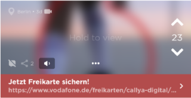

# Our Jodel: Conceptual Design
## Data Model

### Entity-Relationship Diagram

### Data Dictionary

#### Post

| Attribute   | Description                                                  |
| ----------- | ------------------------------------------------------------ |
| message     | Text can have length up to 240 characters.                   |
| imageBase64 | Image encoded base 64. Can be a very short video, up to 20 seconds. |
| color       | The color has no actual meaning. The color is selected randomly when the user press the &ldquo;+&rdquo; button.  Posts can have seven colors:  |
| latitude    | Signed latitude of the location of posting, in degrees, with precision of 5 decimal places. |
| longitude   | Signed longitude of the location of posting, in degrees, with precision of 5 decimal places. |
| distance    | One of the following: &bull; **here**: less than 1 km; &bull; **very-close**: between 1 and 2 km; &bull; **close**: between 2 and 10 km; &bull; **far**: more than 10 km; &bullet; **hometown**: if posted using *hometown* feature. The *hometown* feature allows users to read and write posts in a place they are not currently in. However, this location must be set once by the user and then it can not be changed. Only the current location of the user can be set as his hometown.  At first, only posts posted within a 10 km radius are shown in the feed. When there are many users in the area, the users enjoy a lot of activity; less populated areas, on the contrary, can spot tumbleweed in their less engaged feeds. To mitigate this issue we introduce the *dynamic radius* feature. With the dynamic radius the radius will be increased in 10 km steps, up the maximum of 100 km, until the area has 150 posts.   The distance in kilometers between two points located at (&phi;0, &lambda;0) and (&phi;1, &lambda;1), where latitude &phi; and longitude &lambda; are in degrees,  can be calculated by the following approximate formula:    This approximation is very fast and produces fairly accurate result for small distances. Also in ordering locations by distance, it is much faster to order by squared distance eliminating the need for computing the square root. For instance, the distance between  Praça da Sé in São Paulo, at (-23.5503&deg;, -46.6334&deg;) and  Praça XV in Rio de Janeiro, at (-22.9028&deg;, -43.1733&deg;),  using the above formula, is 360.0 km.  Using an [accurate geodesic calculator](https://geographiclib.sourceforge.io/cgi-bin/GeodSolve?type=I&input=-23.5503+-46.6334+-22.9028+-43.1733&format=g&azi2=f&unroll=r&prec=3&radius=6378137&flattening=1%2F298.257223563&option=Submit), the distance is 361.1 km. |
| city        | Name of the city. e.g.: São Paulo                            |
| createdAt   | Date-time of the post                                        |
| childCount  | For original post, it is the number of replies. For replies, it is 0. |
| voteCount   | number of upvotes minus number of downvotes.  When a post has voteCount of -5 it disappears. |

#### User

| Attribute      | Description                                                  |
| -------------- | ------------------------------------------------------------ |
| **email**      | Email address.                                               |
| activationCode | Activation code.                                             |
| latitude       | Signed latitude of user's location, in degrees, with precision of 5 decimal places. |
| longitude      | Signed longitude of the user's location, in degrees, with precision of 5 decimal places. |
| location       | Name of the user's location, normally equals to the name of the city. |
| city           | Name of the city of the the user's location, e.g.: São Paulo |
| country        | Two letter country code, e.g. BR                             |
| type           | User's type. Users can have one of 6 types: &bull; **Aprendiz** &bull; **Funcionário** &bull; **Colegial** &bull; **Vestibulando** &bull; **Universitário** &bull; **Outros** |
| gender         | &ldquo;m&rdquo; or &ldquo;f&rdquo;                           |
| birthyear      | User's birthyear with 4 digits.                              |
| karma          | User's score:   &bull; The user earns (looses) 2 karma for upvoting (downvoting) on a post  &bull; The user earns (looses) 10 karma when he receives an upvote (downvote)  &bull; The user earns 1 karma for thanking another user who replies to his post  &bull; The replier earns 5 karma for receiving thanks. |

#### Remark

| Attribute | Description                                                  |
| --------- | ------------------------------------------------------------ |
| kind      | One of the following: &bull; **upvote** &bullet; **downvote** &bullet; **subscribe**: when the user posts an original post, reply or pin a thread it gets automatically subscribed &bullet; **thank**: the author can thank for a reply from another user &bullet; **pin**. |

#### Notification

| Attribute | Description                                                  |
| --------- | ------------------------------------------------------------ |
| type      | One of the following: &bullet; **ReplyOnReply**: a reply was posted on a thread, after the user has replied on the same thread &bullet; **ReplyOnOriginal**: a reply was posted on a thread originated from a user's post &bullet; **VoteOnPost**: vote on a post of this user &bullet; **ReplyOnPin**: a reply was posted on a thread pinned by this user |
| read      | Flag to signal that the notification has been read.          |
| time      | Date and time of the event.                                  |

#### BoostedPostBooking

| Attribute | Description                                                  |
| --------- | ------------------------------------------------------------ |
| headline  | The headline of the url. E.g.: **Jetzt Freikarte sichern!**   The post will be boosted in the area of a 10 km radius circle around the point of placement. In each area, there can be only one boosted post at a time. Therefore the distance between two simultaneous boosted posts should always be longer than 20 km. The boosted post appears first in the User's feed. Each boosted post is a regular post, thus Users can vote or reply on it (replying can be optionally disabled by the poster). Only difference: if the User downvote it, the post will disappear for the User. |
| url       | The URL of the ad. E.g.: https://www.vodafone.de/freikarten/callya-digital |
| startTime | Date and time of the booking.                                |
| endTime   | Date and time of the removal.                                |
| latitude  | This is the signed latitude of the point of placement, in degrees, with precision of 5 decimal places. |
| longitude | This is the signed longitude of the point of the placement, in degrees, with precision of 5 decimal places. |
| canReply  | Flag to enable replies to this placement.                    |

#### Channel

| Attribute     | Description                                                  |
| ------------- | ------------------------------------------------------------ |
| **name**      | Unique identifier of channel, CamelCase style.  Users will not be able to create their own channels, but will be able to follow the ones we will create. User's feed will show the original posts with no channel and those from the channels followed by him. |
| description   | Description of this channel.                                 |
| followerCount | Count of the number of users in the local area that are currently following this channel. |

## Functional Processes

### User Account Management

#### Signup

| Functional User | Sub-process Description                                      | Data Group                   | Data Mvmt Type | CFP  |
| ------------------- | ------------------------------------------------------------ | ---------------------------- | ---------------------- | ---- |
| User                | User enters his details                                      | User                         | E                      | 1    |
|                     | Server validates the entered data and checks if the User already exists | User                         | R                      | 1    |
| E-mail provider | Server sends activation code to the User's email             | Activation record            | X                      | 1    |
|                     | Server creates a new User                                    | User                         | W                      | 1    |
| User                | App displays confirmation/error message                      | Confirmation  /Error message | X                      | 1    |

**Total: 5  CFP**

#### Activate App

| Functional User | Sub-process Description                    | Data Group                    | Data Mvmt Type | CFP  |
| ------------------- | ------------------------------------------ | ----------------------------- | ---------------------- | ---- |
| User                | User enters Activation Record              | Activation Record             | E                      | 1    |
|                     | Server authenticates the Activation Record | Activation Record             | R                      | 1    |
|                     | App save Activation Record in the device   | Activation Record             | W                      | 1    |
| User                | App displays confirmation/error message    | Confirmation  / Error message | X                      | 1    |

**Total: 4 CFP**

#### Initialize App

| Functional  User | Sub-process Description                                      | Data Group         | Data Mvmt Type | CFP  |
| -------------------- | ------------------------------------------------------------ | ------------------ | ---------------------- | ---- |
| User                 | User starts App.                                             | Control Command    | E                      | 1    |
|                      | App retrieves the Activation Record.                         | Activation Record  | R                      | 1    |
|                      | Server authenticates the User's Activation Record and returns a JWT Access Token, valid for 24 hours. | User, Access Token | R                      | 1    |
|                      | App saves the Access Token in the device storage. The App will send the Access Token in the authentication header of the HTTP requests: &ldquo;Authentication: Bearer {token}&rdquo;. This authorizes the User for seeing posts, voting, posting etc. | Access Token       | W                      | 1    |
| Location Service     | App gets User Location                                       | User Location      | E                      | 1    |
|                      | Server updates User Location                                 | Device Location    | W                      | 1    |
| User                 | App displays error message                                   | Error message      | X                      | 1    |

**Total: 7 CFP**

### Reading Posts

#### Display Feed

| Functional User | Sub-process Description                                      | Data Group    | Data Mvmt Type | CFP  |
| ------------------- | ------------------------------------------------------------ | ------------- | ---------------------- | ---- |
|                     | After initialization, the App retrieves newest posts in the area. | Post          | R                      | 1    |
|                     | The App display newest posts.                                | Post          | X                      | 1    |
| User                | User can choose the entire feed (default) or only one of his channels by clicking the channel button. In this case, the App retrieves the list of User's Channels and the list of recommended Channels (most popular Channels not followed by the User). | Channel       | R                      | 2    |
| User                | The App displays the list of User's Channels and the list of recommended Channels. If there are new original Posts in one of the User's Channels, its name is written in boldface. | Channel       | X                      | 2    |
| User                | The User can then select the channel he wants to read.       | Channel       | E                      | 1    |
| User                | The User can select to read feed from his current GPS location or hometown on the City drop-down button. The User can select order of posts in the feed by clicking one of buttons on the bottom:  &bullet; &#x1f553; **Newest**: reverse chronological (default);  &bullet; &#x1f4ac; **Most discussed**: reply count descending;  &bullet;  &#x2303; **Loudest**: vote count descending. | Location      | E                      | 1    |
|                     | The App retrieves the posts of the feed. If there is a boosted post in the area and the User has not downvoted it, put it at the top of the feed. | Post          | R                      | 1    |
| User                | App displays the scrollable list of Posts.                   | Post          | X                      | 1    |
| User                | App displays error message                                   | Error message | X                      | 1    |

**Total: 11 CFP**

#### Display Picture Feed

| Functional User | Sub-process Description                                      | Data Group    | Data Mvmt Type | CFP  |
| ------------------- | ------------------------------------------------------------ | ------------- | ---------------------- | ---- |
| User                | In his feed, User hold to view a Picture, then Swipe up  to access Pictures in the Feed after the selected Picture. | Picture       | E                      | 1    |
|                     | App retrieves 1 picture at a time as User scrolls through the Picture Feed screen. | Picture       | R                      | 1    |
| User                | Display the current Picture.                                 | Picture       | X                      | 1    |
| User                | App displays error message.                                  | Error message | X                      | 1    |

**Total: 4 CFP**

#### Display My Pins

| Functional User | Sub-process Description                                      | Data Group    | Data Mvmt Type | CFP  |
| ------------------- | ------------------------------------------------------------ | ------------- | ---------------------- | ---- |
| User                | User clicks on MY KARMA button, at upper right corner of feed screen. Then, on ME screen, User clicks on My Pins. The App retrieves original posts the User pinned in reverse chronological order. | Post          | R                      | 1    |
| User                | Display the list of Posts.                                   | Post          | X                      | 1    |
| User                | App displays error message                                   | Error message | X                      | 1    |

**Total 3 CFP**

#### Display My Replies

| Functional User | Sub-process Description                                      | Data Group    | Data Mvmt Type | CFP  |
| ------------------- | ------------------------------------------------------------ | ------------- | ---------------------- | ---- |
| User                | User clicks on MY KARMA button, at upper right corner of feed screen. Then, on ME screen, User clicks on My Replies. The App retrieves original posts the User replied in reverse chronological order. | Post          | R                      | 2    |
| User                | Display the list of Posts.                                   | Post          | X                      | 1    |
| User                | App displays error message                                   | Error message | X                      | 1    |

**Total: 4 CFP**

#### Display My Votes

| Functional User | Sub-process Description                                      | Data Group    | Data Mvmt Type | CFP  |
| ------------------- | ------------------------------------------------------------ | ------------- | ---------------------- | ---- |
| User                | User clicks on MY KARMA button, at upper right corner of feed screen. Then, on ME screen, User clicks on My Votes. The App retrieves Original Posts the User upvoted in reverse chronological order, even if the User has voted on a Reply and not on the original Post. | Post          | R                      | 2    |
| User                | Display the list of Posts                                    | Post          | X                      | 1    |
| User                | App displays error message                                   | Error message | X                      | 1    |

**Total: 4 CFP**

#### Hashtag Search

| Functional User | Sub-process Description                                      | Data Group    | Data Mvmt Type | CFP  |
| ------------------- | ------------------------------------------------------------ | ------------- | ---------------------- | ---- |
| User                | User clicks on Channels button, at upper left corner of feed screen. Then, on Channels screen, User clicks on the magnifying glass as if searching for a Channel. A bar will show up where the User can switch the search to hashtags instead of Channels. The User then types the hashtag on the search box. The button with the hashtag will show up 3 seconds after the User finishes typing. The User then clicks on the hashtag button to begin searching. | Hashtag       | E                      | 1    |
|                     | The App retrieves the original posts, where the hashtag appears in the original post or in one of its replies. | Post          | R                      | 2    |
| User                | The App displays the list of Posts.                          | Post          | X                      | 1    |
| User                | App displays error message                                   | Error message | X                      | 1    |

**Total: 5 CFP**

